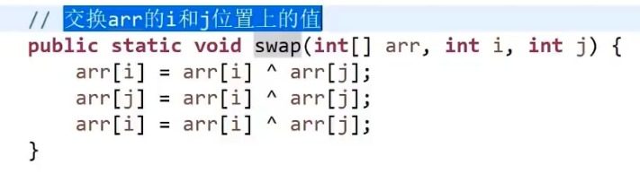
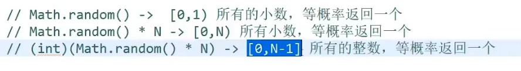

# 时间复杂度

常数操作数量的表达式，忽略低阶项，只要最高阶项并且忽略系数。  
例如
$$
aN^2 + bN + c \: 的时间复杂度为\: O(N^2)\\
O在数学中是一个上限的意思
$$

如果在时间复杂度一样的情况下，如何区分算法的好坏

    a                       b
    O(N)                    O(N)
    常数项 10               常数项100
    常数操作为乘法           常数操作为位运算

    因为上述两个常数操作的时间不一样(一个是乘法，一个是位运算，或者一个乘法操作多一点)，所以想要区分的话只能实际取跑，看看哪个更好一点。

## 选择排序 时间复杂度$O(N^2)$

        [a, b, c, d, e, f, g, h, i, ... z]
    1    ^ 遍历整个数组选最小的放在a位置
    2       ^ 从b位置遍历整个数组选最小的放在b位置
    3          ...
    4                                   ^ 最后一个元素的位置

    常数操作
        数组遍历 N + N - 1 + N - 2 ... 1 等差数列

        元素比较 N + N - 1 + N - 2 ... 1 等差数列

        元素交换 N

时间复杂度位$O(N^2)$ 额外空间复杂度$O(1)$

### 补充

- 等差数列求和公式
$$
S_n =  \frac{1}{2}n(a_1 + a_n) = \frac{d}{2}n^2 + (a_1 - \frac{d}{2})n
$$

- 等比数列求和公式
$$
S_n = n \times a_1 \: (q = 1)\\
S_n = a_1 \times \frac{1-q^n}{1-q} = \frac{a_1 - a_n * q}{1 - q} \: (q \neq 1)\\
$$

- 差比数列求和公式  
差比数列是由一个等差数列和一个等比数列相乘得到的新数列
$$
S_n = \frac{ae -[a + d(n-1)]eq^n}{1-q}  + \frac{deq - deq^n}{(1-q)^2}
$$

    a:等差数列首相
    d:等差数列公差
    e:等比数列首相
    q:等比数列公比

## 冒泡排序

        [a, b, c, d, e, f, g, h, i, ... z]
    0到N-1
    1    ^  ^ 相邻两个数比较 谁大谁网右边移
    2       ^  ^ 相邻两个数比较 谁大谁网右边移
    3                                 ^ ^ 第一轮结束后最大的数在右边N-1位置
    0到N-2
    4   重复上面的操作

时间复杂度为$O(N^2)$  



    异或运算可以理解为无进位相加
    
    a: 10110
    b: 00111
    ------------
    ^  10001

    1) 0 ^ N = N    N ^ N = 0
    2) 异或运算满足交换律和结合律
       a ^ b = b ^ a   (a ^ b) ^ c = a ^ (b ^ c)
    3) 同一批数进行异或运算得到的结果，与谁先异或谁后异或无关

    int a = X
    int b = Y

    a = a ^ b; a = X ^ Y  b = Y
    b = a ^ b; b = X ^ (Y ^ Y) = X  a = X ^ Y
    a = a ^ b; a = X ^ Y ^ X = (X ^ X) ^ Y = Y  b = X

    通过上述操作，利用了1), 2)的性质完成的两个数的互换。

    注意:
    在上述操作中a和b在内存中需要是两块独立的内存区域。
    如果指向同一个内存区域在上述操作结束后，会被抹成0。

### 例题

~~~java
int arr[]
// 1)在数组中 一种数 奇数次， other偶数次
// 2)在数组中 两种数 奇数次， other偶数次
// 时间复杂度O(N)
// 空间复杂度O(1)

// 解1)
int[] arr = [a, b, c, d, e, f, ...];

int eor = 0;

eor = eor ^ a;
eor = eor ^ b;
eor = eor ^ c;
.
.
.
// 全体异或一遍之后，最后的eor就是奇数次的那个数。

// 如果有无进位相加来考虑的话

a 10111
b 11111
c 00111
.
.
.

> 在某一位上如果1有奇数个那么该为结果为1
> 在某一位上如果1有偶数个那么结果为零1
> 所以说异或运算和异或的顺序无关


// 解2)
// 假设另个数为x和y
int[] arr = [a, b, c, d, e, f, ...];

int eor = 0;

eor = eor ^ a;
eor = eor ^ b;
.
.
.

eor = x ^ y; => != 0 => eor上必有一个位置是1
// 假设eor在第8位上为1，则说明x和y在第8位上不相等

// 然后用eor'再去异或数组上所有第8位上为1的数，
// (通过用第八位为1的数对数组再次进行分组，每组异或之后留下来的数必然会是 x 或 y 的其中一个数，因为每组中偶数个的数已经被消掉)
// 最后的得到的结果为 x 或者是 y
// 然后再用 eor ^ eor' 则可以得到另一个数的值

eor' = eor' ^ {数组上所有第八位为1的数}

eor' = x or y;

// 加入得到的数为x
剩下的另一个数 = eor ^ eor' = x ^ y   ^ x

int rightOne = eor & (~eor + 1); // 提取最右边的1 自己与上自己取反加1

//  eor     10001100 <= 1
// ~eor     01110011
// ~eor + 1 01110100 <= 2
// 1 & 2    00000100
// 如果按位取反之后直接与操作的话，结果会为0
// 所以在去反后再加1之后，再进行与操作的话可以保证最右边的1会在与操作之后留下。

public static void printOddTimesNum2(int[] arr) {
    int eor = 0;
    for (int cur : arr) {
        eor ^= cur;
    }
    // eor = a ^ b
    // eor != 0
    // eor必然有一个位置上是1

    int rightOne = eor & (~eor + 1); // 提取最右边的1

    int onlyOne = 0; // eor'
    for (int cur : arr) {
        // 提取数组中元素最右边为1的数来做异或运算
        // 如果是 == 0的话则是 提取数组中元素最右边为0的数
        // 来做异或运算 哪个0 或 1 都可以 最后的结果应该是
        // x 或者是 y
        if ((cur & rightOne) == 1) { 
            onlyOne ^= cur;
        }
    }

    System.out.println(onlyOne + " " + (eor ^ onlyone));
}
~~~

## 插入排序

时间复杂度 $O(N^2)$ ,额外空间复杂度 $O(1)$  
算法流程按照最差的情况来估计时间复杂度

```java
int[] arr = [3, 2, 4, 5, 3, 2, 2, 1];
             ^  ^  ^  ^  ^  ^  ^  ^
             0  1  2  3  4  5  6  7 

// 0 ~ 0 有序 从0位置往前看，比较各个元素大小并且交换位置直到有序
// 0 ~ 1 有序 从1位置往前看，比较各个元素大小并且交换位置直到有序
// 0 ~ 2 有序 从2位置往前看，比较各个元素大小并且交换位置直到有序
// ...
// 0 ~ 7 有序 同上

// 该方法跟斗地主一样， 每抓一张牌从后往前看， 找到合适的位置然后插入

// 该方法的时间复杂度，会根据数据状况不同热导致，时间复杂度不一样
// 当数组本身有序，那么时间复杂度位O(N)
// 最差情况，该数组按照降序排列，而用该方法去把数组改成升序排列时，
// 则每个位置都需要进行比较和插入操作， 时间复杂度位O(N^2)
```

时间复杂度记号
$$
O() 最差 \:\: 时间复杂度一般是指最差情况的时间复杂度 \\
\theta() 平均\:\: 工程上用的\\
\Omega() 最优数据情况的表现\\
$$

## 二分法的详解与扩展

1. 在一个有序数组中，找某个数是否存在
2. 在一个有序数组中，找>=某个数最左侧的位置，或找<=某个数最右侧的位置
3. 局部最小问题

```java
// 1 在一个有序数组中，找某个数是否存在
int[] arr = [a, b, c, d, e, f, g, h, i, j]; // 有序
//                             ^
// 先找中间的位置然后比较，
// x > num 去右边继续做2分
// x < num 去做边继续做2分

// 时间复杂度
// 8 4 2 1
```

$$
O(Log_2N)\\
O(LogN) 以2为低的缩写
$$

```java
// 2 在一个有序数组中，找>=某个数最左侧的位置
int num >= 3 //最左的位置
int[] arr = [12222233334444455555555]; // 有序
                  || |  ^
1                 || |  v 
                  ^| |          
2                 x| |
                   | ^
3                  | v
                   ^
4                  v 最左
```

```java
// 3 当 arr中 无序 相邻两个数一定不相等
// 求局部最小(一个就行) 要求时间复杂度好于O(N)
// a < b 数组最左边的情况
// 0   1
// 则a为局部最小
// a > b 数组最有边的情况
// N-2 N-1
// 则b为局部最小
// a > b < c 数组中间任意为值得情况
// i-1 i   i+1
// 则b为局部最小


1 如果0位值 小于1位置 则0位值为局部最小直接返回
2 如果N-1位值 小于N-2位置 则N-1位值为局部最小直接返回
3 如果上面连个都不满足则会出现下面的情况
  数组两边成向下的趋势，则数组中一定存在一个局部最小
  然后二分中点M 比较 M-1 M+1 判断M是不是局部最小， 如果不是
  则假设M-1 与 M 的关系成向下的趋势， 然后向左继续做二分直到找到局部最小
     \                              /
    0  1     M-1   M   M+1      N-2   N-1
                   ^
                  /               
```

### 日常的优化方向

1. 数据状况
2. 问题的标准

## 对数器

1. 有一个你想要测得方法a
2. 实现复杂度不好但是容易实现的方法b
3. 实现一个随机样本产生器
4. 把方法a和方法b跑相同的随机样本，看看得到的结果是否一样
5. 如果有一个随机样本使得对比结果不一致，打印样本进行人工干预，改对方法a或者方法b
6. 当样本数量很多时对比测试依然正确，可以确定方法a已经正确


