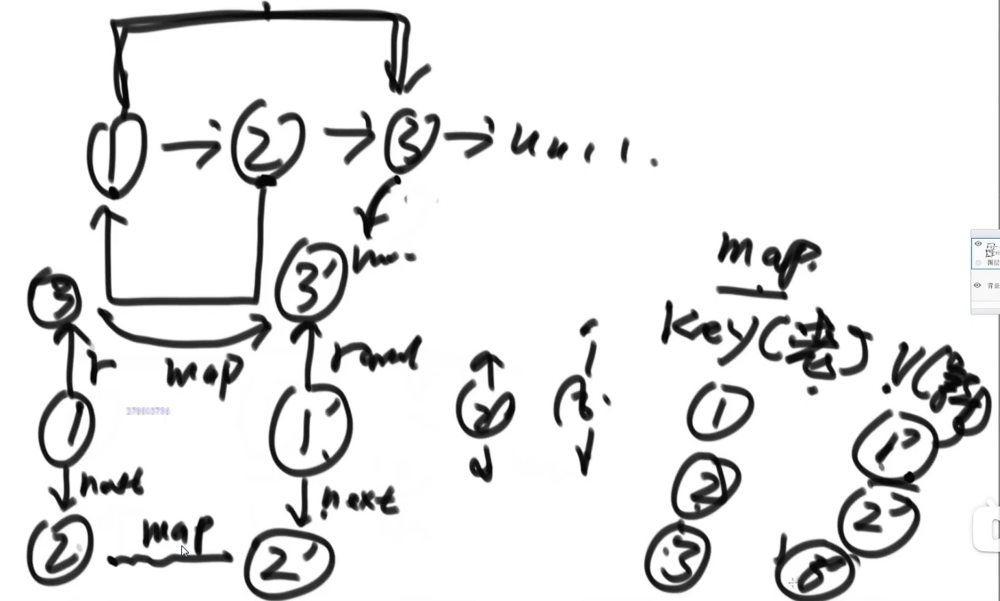
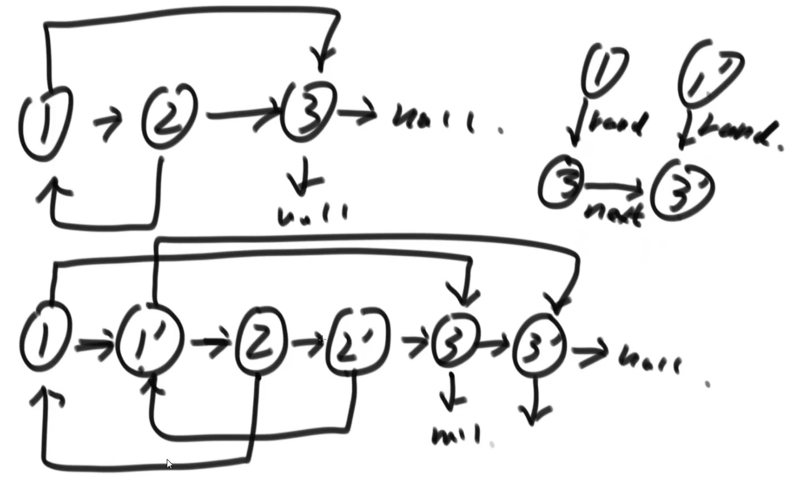

# 链表

## 哈希表的简单介绍

1. 哈希表在使用上可以理解为一种集合结构
2. 如果只有key，没有伴随数据value，可以使用HashSet结构(C++中叫UnOrderedSet)
3. 如果既有key，又有伴随数据value，可以使用HashMap结构(C++中叫UnOrderedMap)
4. 有无伴随数据，是HashSet和HashMap唯一的区别，底层的实际结构是一回事
5. 使用哈希表增(put),删(remove),改(put),查(get)的操作，可以认为是时间复杂度为O(1),但是常数时间比较大
6. 放入哈希表的东西，如果是基础类型，内部按值传递，内存占用就是这个东西的大小。
7. 放入哈希表的东西，如果不是基础类型，内部按引用传递，内存占用是这个东西内存地址的大小。
   例如 Student 类作为key的话 实际key的值为student类的内存地址，一律为8字节

## 有序表的简单介绍

1. 有序表在使用层面上可以理解为一种集合结构
2. 如果只有key，没有伴随数据value，可以使用TreeSet结构(C++中叫OrderedSet)
3. 如果既有key，又有伴随数据value，可以使用TreeMap结构(C++中叫OrderedMap)
4. 有无伴随数据，是TreeSet和TreeMap唯一的区别，底层的实际结构是一回事
5. 有序表和哈希表的区别是，有序表把key按照顺序组织起来，而哈希表完全不组织
6. 红黑树，AVL树，size-balance-tree和跳表等都属于有序表结构，只是底层实现不同
7. 放入有序表的东西，如果是基础类型，内部按值传递，内存占用就是这个东西的大小。
8. 放入有序表的东西，如果不是基础类型，**必须提供比较器**，内部按引用传递，内存占用是这个东西内存地址的大小。
   为了有序组织key所以，必须提供比较器。
9. 不管是什么底层具体实现，只要是有序表，都有以下固定的基本功能和固定的时间复杂度

```java
class HashAndTree {
    // 下列所有操作的性能为O(logN)级别
    public static void Tree_Set_Map () {
        TreeMap<Integer, String> treeMap1 = new TreeMap<>();
        treeMap1.put(7, "I am 7");
        treeMap1.put(5, "I am 5");
        treeMap1.put(4, "I am 4");
        treeMap1.put(3, "I am 3");
        treeMap1.put(9, "I am 9");
        treeMap1.put(2, "I am 2");
        treeMap1.put(7, "I am 7");
        treeMap1.put(7, "I am 7");

        System.out.println(treeMap1.containsKey(5));
        System.out.println(treeMap1.get(5));
        System.out.println(treeMap1.firstKey() + "min key");
        System.out.println(treeMap1.lastKey() + "max key");
        System.out.println(treeMap1.floorKey(8) + "在表中所有<=8的数中，我离8最近");
        System.out.println(treeMap1.ceilingKey(8) + "在表中所有>=8的数中，我离8最近");

        treeMap1.remove(5);
        System.out.println(treeMap1.get(5), "it's already deleted.");

        public static class Node {
            public int value;
            public Node next;

            public Node(int val) {
                value = val;
            }
        }

        public static class NodeComparator implements Comparator<Node> {
            @Override
            public int compare(Node o1, Node o2) {
                retrun o1.value - o2.value;
            }
        }
        
        // 当key为非基本数据类型时，必须要提供比较器
        TreeSet<Node> treeSet = new TreeSetM<> (new NodeComparator());
    }
}
```

## 单链表的节点结构

```java
Class Node<V> {
    V value;
    Node next;
}
```

由以上结构的节点依次连接起来所形成的链叫单链表结构

## 双链表的节点结构

```java
Class Node<V> {
    V value;
    Node next;
    Node last;
}
```

由以上结构的节点依次连接起来所形成的链叫做双链表结构。

单链表结构和双链表结构只需要给定一个头部节点head，就可以找到剩下的所有的节点。

## 面试时链表解题的方法论

1. 对于笔试，不用太在乎空间复杂度，一切为了时间复杂度
2. 对于面试，时间复杂度依然放在第一位，但是一定要找到空间最省的方法

## 重要技巧

1. 额外数据结构记录(哈希表等)
2. 快慢指针

## 判断一个链表是否为回文结构

【题目】 给定一个单链表的头结点head，请判断该链表是否为回文结构。
【例子】 1->2->1 返回true; 1->2->2->1, 返回true; 15->6->15,返回true; 1->2->3,返回false;
【例子】 如果链表长度为N，时间复杂度达到O(N),额外空间复杂度达到O(1)

如果是笔试的话，将单链表节点，依次放入栈中，应为栈有先进后出的特点，所以再重头遍历单链表，一遍遍历一遍从栈中弹出节点比对，
如果都一样的话，则为回文结构。

稍微省空间一点的解法，利用快慢指针

```java
 1 2 3 2 1
S
F

快指一次走两步，慢指针一次走一步，这样当快指针来到单链表末尾的时候，慢指针回来到链表中点的位置，
然后将链表后半部分放到栈中，然后再一个一个弹出来进行比较
边界条件的控制 需要自己练习

额外空间复杂度达到O(1)的解法

 1 -> 2 -> 3 -> 2 -> 1
S
F

利用快慢指针，当慢指针来到中点后，将链表后半部分逆序后再进行逐个比较，
返回结果后，将链表复原

          null            
           ^
 1 -> 2 -> 3 <- 2 <- 1
           S
                      F
 A                   B
```

```java
public class Code_IsPalindromeList {

    public static class Node {
        public int value;
        public Node next;

        public Node (int data) {
            this.value = data;
        }
    }

    // need n extra space
    public static boolean isPalindrom1(Node head) {
        Stack<Node> stack = new Stack<Node>();

        Node cur = head;
        while (cur != null) {
            stack.push(cur);
            cur = cur.next;
        }
        while (head != null) {
            if (head.value != stack.pop().value) {
                return false;
            }
            head = head.next();
        }
        return true;
    }

    // need n/2 extra space
    public static boolean isPalindrom2(Node head) {
        if (head == null || head.next == null) {
            return true;
        }

        Node right = head.next;
        Node cur = head;
        while (cur.next != null && cur.next.next != null) {
            right = right.next;
            cur = cur.next.next;
        }
        Stack<Node> stack = new Stack<Node>();
        while (right != null) {
            stack.push(right);
            right = right.next;
        }
        while (!stack.isEmpty()) {
            if (head.value != stack.pop().value) {
                return false;
            }
            head = head.next;
        }
        return true;
    }

    // need O(1) extra space
    public static boolean isPalindrom3(Node head) {
         if (head == null || head.next == null) {
            return true;
        }

        Node n1 = head;
        Node n2 = head;

        while (n2.next != null && n2.next.next != null) { // find mid node
            n1 = n1.next; // n1 -> mid
            n2 = n2.next.next; // n2 -> end
        }

        // 右半部分逆序
        n2 = n1.next;
        n1.next = null;
        Node n3 = null;
        while (n2 != null) { // right part convert
            n3 = n2.next; // n3 -> save next node
            n2.next = n1; // next of right node convert
            n1 = n2;
            n2 = n3;
        }

        n3 = n1; // n3 -> save last node
        n2 = head // n2 -> left first node
        boolean res = true;
        while (n1 != null && n2 != null) { // check palindrome
            if (n1.value != n2.value) {
                res = false;
                break;
            }
            n1 = n1.next; // left to mid
            n2 = n2.next; // right to mid
        }

        n1 = n3.next;
        n3.next = null;
        while (n1 != null) { // recover list
            n2 = n1.next;
            n1.next = n3;
            n3 = n1;
            n1 = n2;
        }

        return res;
    }
}
```

## 将单向链表按某值划分成左边小，中间相等，右边大的形式

【题目】 给定一个单链表的头结点head,节点的值类型时整型，再给定一个整数pivot。实现一个调整链表的函数，将链表调整为左边部分都是值
小于pivot的节点，中间部分都是值等于pivot的节点，右边部分都是值大于pivot的节点。

【进阶】在实现原问题功能的基础上增加如下要求
【要求】调整后所有小于pivot的节点之间的相对顺序和调整前一样
【要求】调整后所有等于pivot的节点之间的相对顺序和调整前一样
【要求】调整后所有大于pivot的节点之间的相对顺序和调整前一样
【要求】时间复杂度请达到O(N),额外空间复杂度达到O(1)

```java
解法1:将所有节点放到数组里去，然后玩partation操作，类似荷兰国旗问题

解法2:

4 -> 6 -> 3 -> 5 -> 8 -> 5 -> 2          5

SH = null   EH = null   bH = null
ST = null   ET = null   bT = null

4 -> 6 -> 3 -> 5 -> 8 -> 5 -> 2          5
^
SH = 4   EH = null   bH = null
ST = 4   ET = null   bT = null

4 -> 6 -> 3 -> 5 -> 8 -> 5 -> 2          5
     ^
SH = 4   EH = null   bH = 6
ST = 4   ET = null   bT = 6

4 -> 6 -> 3 -> 5 -> 8 -> 5 -> 2          5
          ^
SH = 4   EH = null   bH = 6
     v
ST = 3   ET = null   bT = 6

4 -> 6 -> 3 -> 5 -> 8 -> 5 -> 2          5
               ^
SH = 4   EH = 5   bH = 6
     v
ST = 3   ET = 5   bT = 6

4 -> 6 -> 3 -> 5 -> 8 -> 5 -> 2          5
                    ^
SH = 4   EH = 5   bH = 6
     v                 v
ST = 3   ET = 5   bT = 8

4 -> 6 -> 3 -> 5 -> 8 -> 5 -> 2          5
                         ^
SH = 4   EH = 5   bH = 6
     v        v        v
ST = 3   ET = 5   bT = 8

4 -> 6 -> 3 -> 5 -> 8 -> 5 -> 2          5
                              ^
SH = 4   EH = 5   bH = 6
     v        v        v
     3   ET = 5   bT = 8
     v
ST = 2

最后连接按顺序连接 SH ST EH ET bH bT

public class Code_SmallerEqualBigger {
    public static class Node {
        public int value;
        public Node next;

        public Node (int data) {
            this.value = data;
        }
    }

    public static Node listPartition2(Node head, int pivot) {
        Node sH = null; // small head
        Node sT = null; // small tail
        Node eH = null; // equal head
        Node eT = null; // equal tail
        Node mH = null; // big head
        Node mT = null; // big tail
        Node next = null; // save next node
        // every node distributed to three lists
        while (head != null) {
            next = head.next;
            head.next = null;
            if (head.value < pivot) {
                if (sH == null) {
                    sH = head;
                    sT = head;
                } else {
                    sT.next = head;
                    sT = head;
                }
            } else if (head.value == pivot) {
                if (eH == null) {
                    eH = head;
                    eT = head;
                } else {
                    eT.next = head;
                    eT = head;
                }
            } else if (head.value > pivot) {
                if (mH == null) {
                    mH = head;
                    mT = head;
                } else {
                    mT.next = head;
                    mT = head;
                }
            }
            head = next;
        }
        // small and equal reconnect
        if (sT != null) { // 如果有小于区
            st.Next = eH;
            eT = eT == null ? sT :eT // 下一步谁去连大于去的头，谁就变成
        }
        // 上面的if，不管跑了没有，et
        // all reconnect
        if (et != null) { // 如果小于区和等于区，不是都没有
            et.next = mH;
        }
        return sH != null ? sH : (eH != null ? eH : mH);
    }
}
```

## 复制含有随机指针节点的链表

【题目】一种特殊的单链表节点的类描述如下

```java
class Node {
    int value;
    Node next;
    Node rand;
    Node(int val) {
        value = val;
    }
}
```

rand指针是单链表节点结构中新增的指针，rand可能指向链表中的任意一个节点，也可能指向null。
给定一个由Node节点类型组成的无环单链表的头节点head，请实现一个函数完成这个链表的复制，并返回复制的新的头结点。
【要求】时间复杂度O(N), 额外空间复杂度O(1)

解法1:
将链表的元素，和拷贝后的元素放到hashmap里，然后通过map的对应关系来设定拷贝后的节点指向


```java
public static Node copyListWithRand1(Node node) {
    HashMap<Node, Node> map = new HashMapM<Node, Node>();
    Node cur = head;
    while (cur != null) {
        map.put(cur, new Node(cur.value));
        cur = cur.next;
    }
    cur = head;
    while (cur != null) {
        map.get(cur).next = map.get(cur.next);
        map.get(cur).rand = map.get(cur.rand);
        cur = cur.next;
    }
    return map.get(head);
}
```

解法2:
不利用Hash表怎么做
先设置好1' 2' ... 的rand值，然后再通过各节点的next来分离链表


```java
public static Node copyListWithRand2(Node head) {
    if (head == null) {
        return null;
    }

    Node cur = head;
    Node next = null;

    // copy node and link to every node
    // 1 -> 2
    // 1 -> 1' -> 2
    while (cur != null) {
        next = cur.next;
        cur.next = new Node(cur.value);
        cur.next.next = next;
        cur = next;
    }
    cur = head;
    Node curCopy = null;
    // set copy node rand
    // 1 -> 1' -> 2 -> 2'
    while (cur != null) {
        next = cur.next.next;
        curCopy = cur.next;
        curCopy.rand = cur.rand != null ? cur.rand.next : null;
        cur = next;
    }
    Node res = head.next;
    cur = head;
    // split
    while (cur != null) {
        next = cur.next.next;
        curCopy = cur.next;
        cur.next = next;
        curCopy.next = next != null ? next.next : null;
        cur = next;
    }
    return res;
}
```

## 两个单向链表相交的一系列问题

【题目】给定两个可能有环也可能无环的单链表，头结点head1和head2。请实现一个函数，如果两个链表相交，请返回相交的第一个节点。
如果不相交返回null
【要求】如果两个链表长度之和为N，时间复杂度请达到O(N),额外空间复杂度请达到O(1)。