# 二叉树

## 题目1 二叉树节点结构

```java
class Node<V> {
    V value;
    Node left;
    Node right;
}
```

用递归和非递归两种方式实现二叉树的先序，中序，后序遍历

如何直观的打印一颗二叉树

如何完成二叉树的宽度优先遍历(常见题目: 求一颗二叉树的宽度)

递归方法完成二叉树的遍历每一个节点都能回到3次

```java
public static void f(Node head) {
    if (head == null) {
        return;
    }

    f(head.left);
    f(head.right);
}
```

## 用递归和非递归两种方式实现二叉树的先序，中序，后序遍历

---

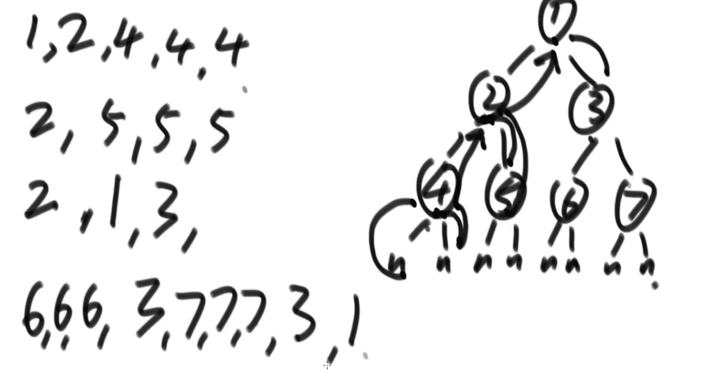

先序 先打印头节点  再打印左子树上所有的节点  在打印右子树上所有的节点  
先序遍历是由递归序加工而来


中序 左 头 右  
由递归序加工，在第二次回到自己的时候打印  
后序 左 右 头  
由递归序加工，在第三次回到自己的时候打印  

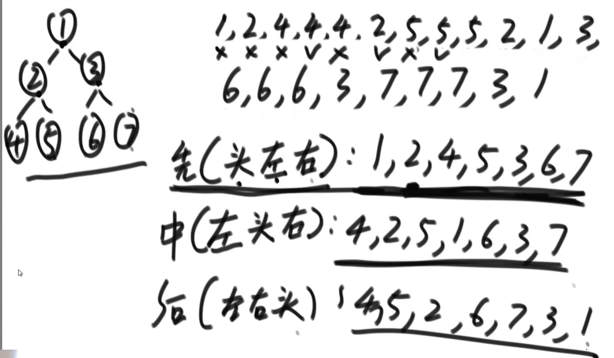

```java
public static void preOrderRecur(Node head) {
    if (head == null) {
        return;
    }

    System.out.print(head.value + " ");
    preOrderRecur(head.left);
    preOrderRecur(head.right);
}

public static void inOrderRecur(Node head) {
    if (head == null) {
        return;
    }

    inOrderRecur(head.left);
    System.out.print(head.value + " ");
    inOrderRecur(head.right);
}

public static void posOrderRecur(Node head) {
    if (head == null) {
        return;
    }

    posOrderRecur(head.left);
    posOrderRecur(head.right);
    System.out.print(head.value + " ");
}

public static void main(String[] args) {
    Node head = new Node(5);
    head.left = new Node(3);
    head.right = new Node(8);
    head.left.left = new Node(2);
    head.left.right = new Node(4);
    head.left.left = new Node(1);
    head.right.left = new Node(7);
    head.right.left.left = new Node(6);
    head.right.right = new Node(10);
    head.right.right.left = new Node(9);
    head.right.right.right = new Node(11);

    // recursive
    System.out.println("===============recursive================");
    System.out.println("pre-order");
    preOrderRecur(head);
    System.out.println();
    System.out.println("in-order");
    inOrderRecur(head);
    System.out.println();
    System.out.println("pos-order");
    posOrderRecur(head);
    System.out.println();
}
```

任何递归都可以改成非递归  
非递归先序遍历  

先将头结点压入栈中
每次

1. 从栈中弹出一个节点cur
2. 打印处理cur
3. 先右在左(如果有)
4. 周而复始

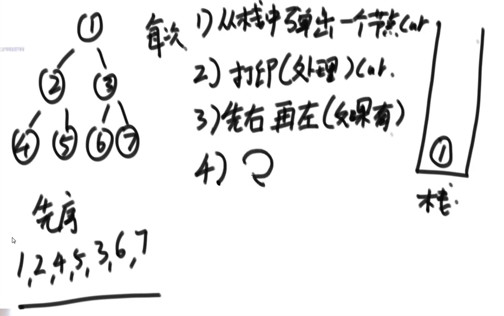

```java
public static void preOrderUnRecur(Node) {
    System.out.print("pre-order");
    if (head != null) {
        Stack<Node> stack = new Stack<Node>();
        stack.add(head);
        while(!stack.isEmpty()) {
            head = stack.pop();
            System.out.print(head.value + " ");
            if (head.right != null) {
                stack.push(head.right);
            }
            if (head.left != null) {
                stack.push(head.left);
            }
        }
    }
    System.out.println();
}
```

非递归后序遍历
先将头结点压入栈中
每次

1. 从栈中弹出一个节点cur
2. cur放入收集栈
3. 先左再右(如果有)
4. 周而复始

因为每次放入收集栈的顺序为 头 右 左  
然后再从收集栈中弹出的顺序为 左 右 头 从而实现后序遍历

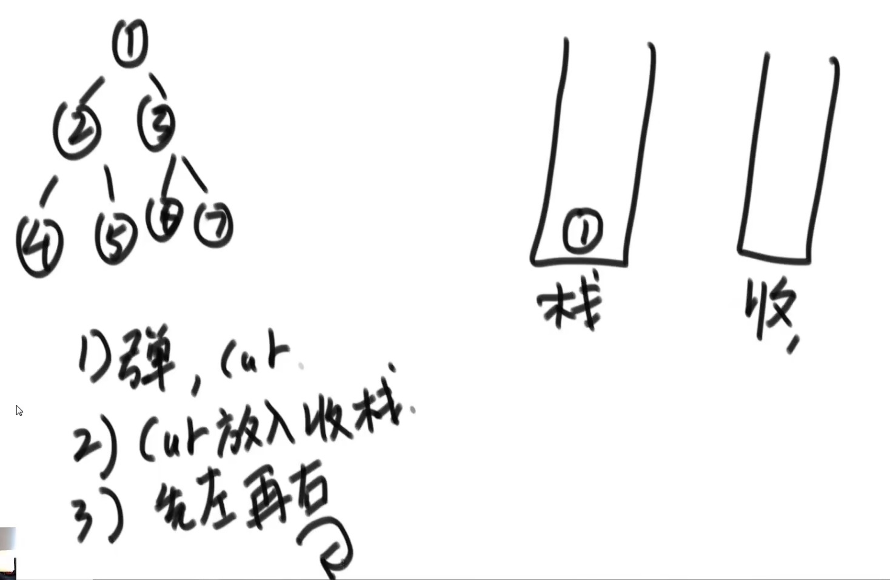

```java
public static void posOrderUnRecur1(Node head) {
    System.out.print("pos-order: ");
    if (head != null) {
        Stack<Node> s1 = new Stack<Node>();
        Stack<Node> s2 = new Stack<Node>();
        s1.push(head);
        while (s1 != null) {
            head = s1.pop();
            s2.push(head);
            if (head.left != null) {
                s1.push(head.left);
            }
            if (head.right != null) {
                s2.push(head.right);
            }
        }
        while (!s2.isEmpty()) {
            System.out.print(s2.pop().value + " ");
        }
    }
    System.out.println();
}
```

非递归中序遍历  

中: 左 头 右

1. 每颗子树，整颗数左边界进栈
2. 依次弹出的过程中，打印
3. 对弹出节点的右树做周而复始的操作

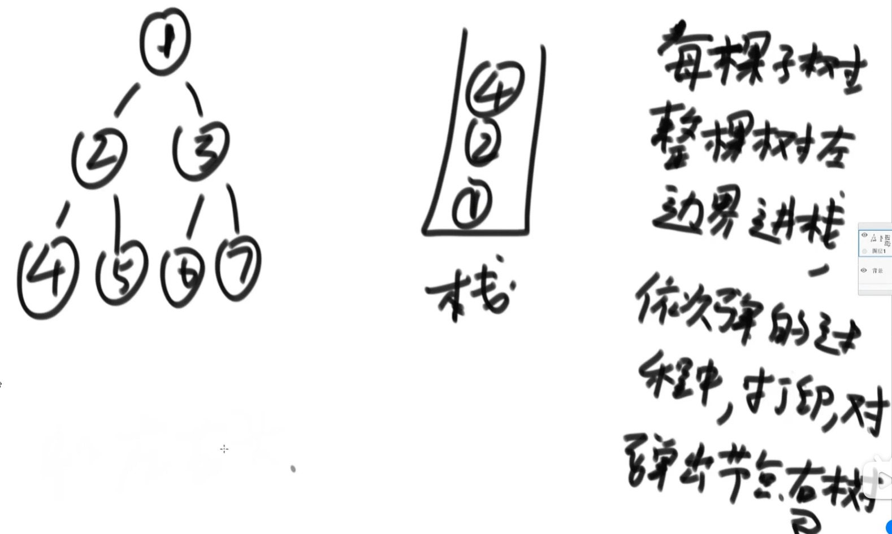

```java
public static void inOrderUnRecur(Node head) {
    System.out.print("in-order: ");
    if (head != null) {
        Stack<Node> stack = new Stack<Node>();
        while (!stack.isEmpty() || head != null) {
            if (head != null) {
                stack.push(head);
                head = head.left;
            } else {
                head = stack.pop();
                System.out.print(head.value + " ");
                head = head.right;
            }
        }
    }
    System.out.println();
}
```

实质  
二叉树可以被左树分解  
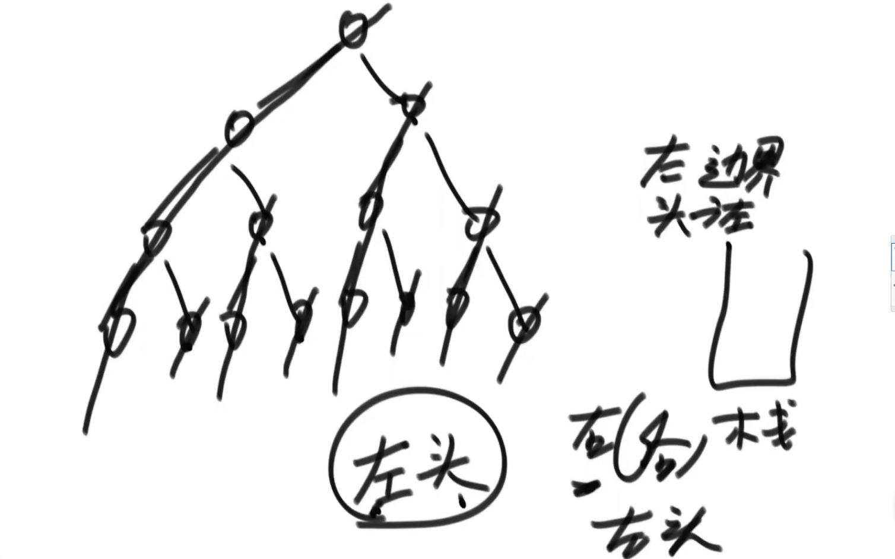
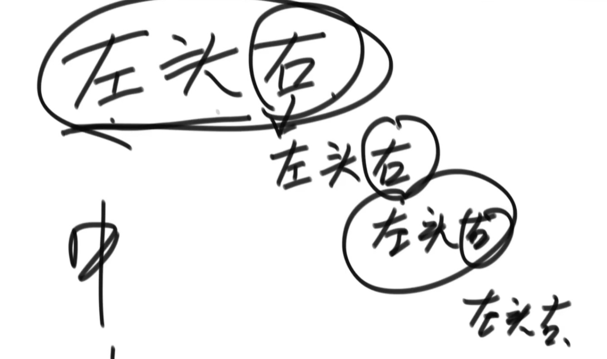

## 如何直观的打印一颗二叉树

领取视频资料加小助理WX：msb6989

## 如何完成二叉树的宽度优先遍历(常见题目: 求一颗二叉树的宽度)

二叉树的先序遍历就是二叉树的深度优先遍历(求一颗二叉树的最大宽度)

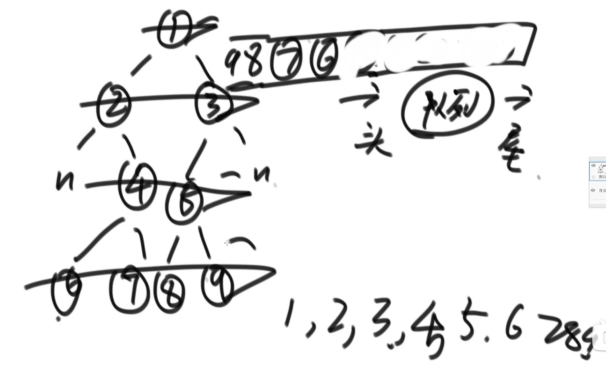

1. 先将头结点放入队列
2. 弹出节点，然后将该节点的左右孩子节点依次放入队列
3. 周而复始

```java
public static int w(Node head) {
    if (head == null) {
        return;
    }

    Queue<Node> queue = new LinkedList<>();
    queue.add(head);

    // add 求二叉树宽度
    HashMap<Node, Integer> levelMap = new HashMap<>();
    levelMap.put(head, 1);
    int curLevel = 1;
    int curLevelNodes = 0;
    int max = Integer.MIN_VALUE;

    while (!queue.isEmpty()) {
        Node cur = queue.poll();

        // add 求二叉树宽度
        int curNodeLevel = levelMap.get(cur);
        if (curNodeLevel == curLevel) {
            curLevelNodes++;
        } else {
            // 弹出节点为下一层节点
            max = Math.max(max, curLevelNodes);
            curLevel++
            curLevelNodes = 1;
        }

        System.out.println(cur.value);
        if (cur.left != null) {
            queue.add(cur.left);

            // add 求二叉树宽度
            leveMap.put(cur.left, curNodeLevel + 1);
        }
        if (cur.right != null) {
            queue.add(cur.right);

            // add 求二叉树宽度
            levelMap.put(cur.right, curNodeLevel + 1);
        }
    }
     
    return max;
}
```

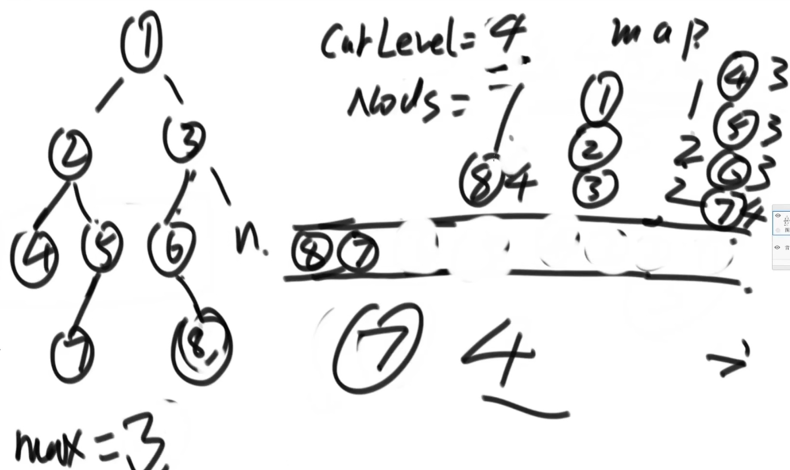

不用Hash表的方法求二叉树的最大宽度  

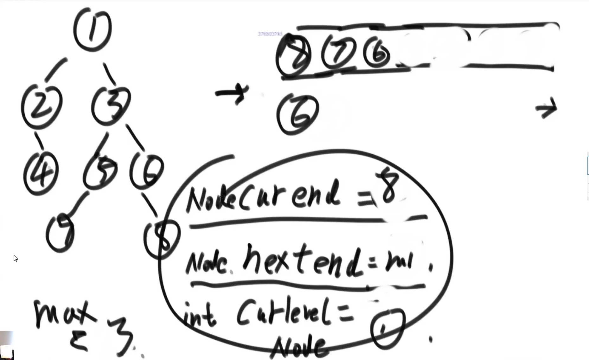

```java
// 记录当前层和下一层的最后一个节点
// 通过最后一个节点来判断当前层是否遍历结束
// 在遍历每一层时计数，结束时更新max
```

## 二叉树的相关概念以及实现判断

- 如何判断一颗二叉树是搜素二叉树  
  每一颗子树，它的左树都比它小，右树都比它大  
  求解方法: 利用中序遍历看每颗子树的左头右是否为升序，如果满足则该树为搜索二叉树
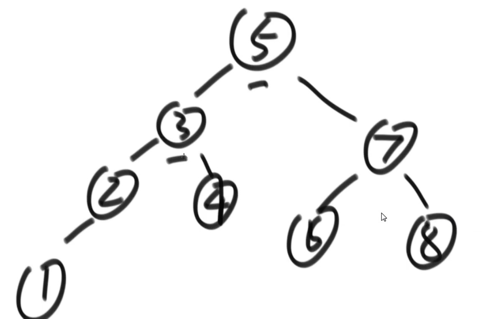

```java
public static int preValue = Integer.MIN_VALUE;

public static void boolean checkBST(Node head) {
    if (head == null) {
        return true;
    }
    boolean isLeftBst = checkBST(head.left);
    if (!isLeftBst) {
        return false;
    }
    if (head.value <= preValue) {
        return false;
    } else {
        preValue = head.value;
    }

    return checkBST(head.right);
}

// 更简单的实现
public static boolean checkBST2(Node node) {
    List<Node> inOrderList = new ArrayList<>();
    process2(head, inOrderList);
    Node preNode = null;
    for (Node curNode : inOrderList) {
        if (preNode != null && preNode.value > curNode.value) {
            return false;
        }
        preNode = curNode;
    }
}

public static void process2(Node head, List<Node> inOrderList) {
    if (head == null) {
        return;
    }
    process2(head.left, inOrderList);
    inOrderList.add(head);
    process2(head.right, inOrderList);
}

// 非递归方式来判断搜索二叉树
public static boolean checkBST3(Node head) {
    if (head != null) {

        int preValue = Integer.MIN_VALUE;

        Stack<Node> stack = new Stack<>();
        while (!stack.isEmpty() || head != null) {
            if (head != null) {
                stack.push(head);
                head = head.left;
            } else {
                head = stack.pop();
                
                System.out.print(head.value);
                if (head.value <= preValue) {
                    return false;
                } else {
                    prevalue = head.value;
                }

                head = head.right;
            }
        }
    }

    return true;
}
```

- 如何判断一颗二叉树是完全二叉树

  利用宽度优先遍历  
  1. 如果任意一个节点，只有右孩子，没有左孩子则该二叉树不是完全二叉树
  2. 在第一个条件不违规的情况下，如果遇到了第一个左右孩子不全的节点，后续皆为叶
  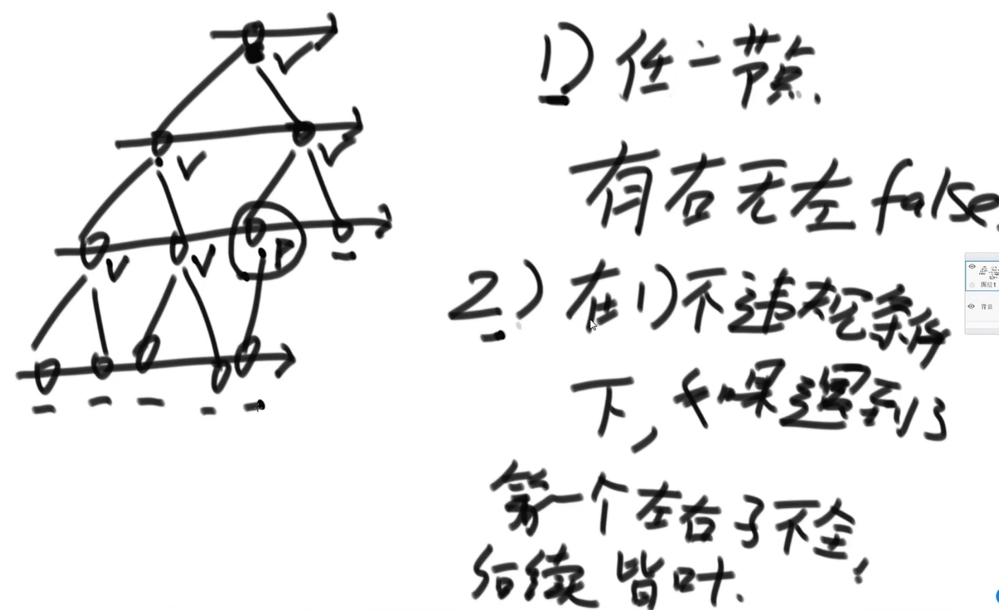

  ```java
  public static boolean isCBT(Node head) {
    if (head == null) {
        return true;
    }
    LinkedList<Node> queue = new LinkedList<>();
    // 是否遇到过左右两个孩子不全的节点
    boolean leaf = false;
    Node l = null;
    Node r = null;
    queue.add(head);
    while (!queue.isEmpty()) {
        head = queue.poll();
        l = head.left;
        r = head.right;

        if (
            // 如果遇到了不双全的节点之后，又发现当前节点居然有孩子
            (leaf && (l != null || r != null))
            ||
            (l == null && r != null)
        ) {
            return false;
        }

        if (l != null) {
            queue.add(l);
        }

        if (r != null) {
            queue.add(r);
        }

        if (l == null || r == null) { // ? r==null 这个条件应该不要也行
            leaf = true;
        }
    }
    return true;
  }
  ```

- 如何判断一颗二叉树是否是满二叉树
  - 解法1
    1. 求出二叉树最大深度 L
    2. 求出二叉树节点个数 N
    3. N = 2^L - 1

- 如何判断一颗二叉树是平衡二叉树
  平衡二叉树的判断条件(套路1)
  1. 任意节点的左子树为平衡二叉树
  2. 任意节点的右子树为平衡二叉树
  3. 左高-右高的绝对值 <= 1
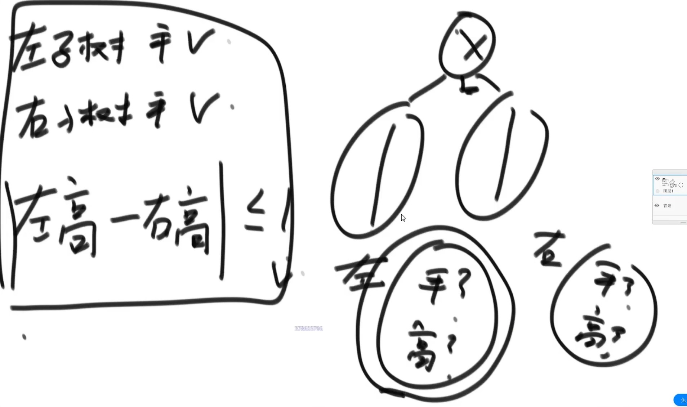

```java
public static boolean isBalanced(Node head) {
    return process(head).isBalanced;
}

public static class RetrunType {
    public boolean isBalanced;
    public int height;

    public ReturnType(boolean isB, int hei) {
        this.isBalanced = isB;
        this.height = hei;
    }
}

public static ReturnType process(Node x) {
    // Base Case
    if (x == null) {
        return new ReturnType(true, 0);
    }

    ReturnType leftData = process(x.left);
    ReturnType rightData = process(x.right);

    int height = Math.max(leftData.height, rightData.height) + 1;
    boolean isBalanced = 
        leftData.isBalanced && 
        rightData.isBalanced && 
        Math.abs(leftData.height - rightData.height) < 2;
    
    return new ReturnType(isBalanced, height);
}
```

- 如果判断一颗二叉树是否是搜索二叉树  

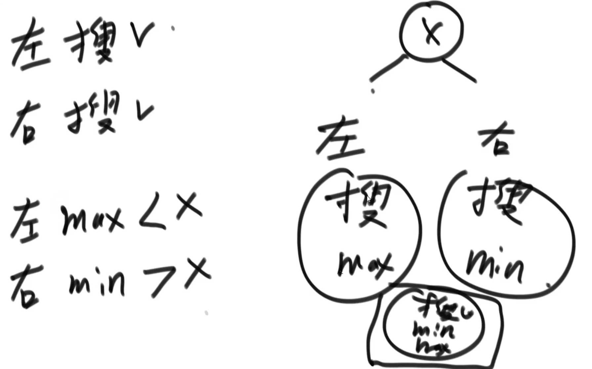

```java
public static class ReturnData {
    public boolean isBST;
    public int min;
    public int max;

    public ReturnData(boolean is, int mi, int ma) {
        isBST = is;
        min = mi;
        max = ma;
    }
}

public static ReturnData process(Node x) {
    // Base case
    if (x == null) {
        return null;
    }

    ReturnData leftData = process(x.left);
    ReturnData rightData = process(x.right)

    int min = x.value;
    int max = x.value;

    if (leftData != null) {
        min = Math.min(min, leftData.min);
        max = Math.max(max, leftData.max);
    }
    if (rightData != null) {
        min = Math.min(min, rightData.min);
        max = Math.max(max, rightData.max);
    }

    boolean isBST = true;

    if (leftData != null && (!leftData.isBST || leftData.max >= x.value)) {
        isBST = false;
    }
    if (rightData != null && (!rightData.isBST || x.value >= rightData.min)) {
        isBST = false;
    }

    // 另一种写法
    // boolean isBST = false;

    // if (
    //     (leftData != null ? (leftData.isBST && leftData.max < x.value) : true)
    //     &&
    //     (rightData != null ? (leftData.isBST && rightData.min > x.value) : true)
    // ) {
    //     isBST = true;
    // }

    return new ReturnData(isBST, min, max);
}
```

递归套路可以解决一切面试中的树型DP(动态规划)问题  

- 如何判断一颗二叉树是否是满二叉树

```java
public static boolean isF(Node head) {
    if (head == null) {
        return true;
    }
    Info data = process(head);
    return data.nodes == (1 << data.height - 1); // 2^L - 1
}

public static class Info {
    public int height;
    public int nodes;

    public Info(int h, int n) {
        height = h;
        nodes = n;
    }
}

public static Info process(Node x) {
    if (x == null) {
        return new Info(0, 0);
    }

    Info leftData = process(x.left);
    Info rightData = process(x.right);

    int height = Math.max(leftData.height, rightData.height) + 1;
    int nodes = leftData.nodes + rightData.nodes + 1;

    return new Info(height, nodes);
}

```

## 给定两个二叉树的节点node1和node2,找到他们的最低公共祖先节点

D,F -> R | E,F -> E | D,I -> A
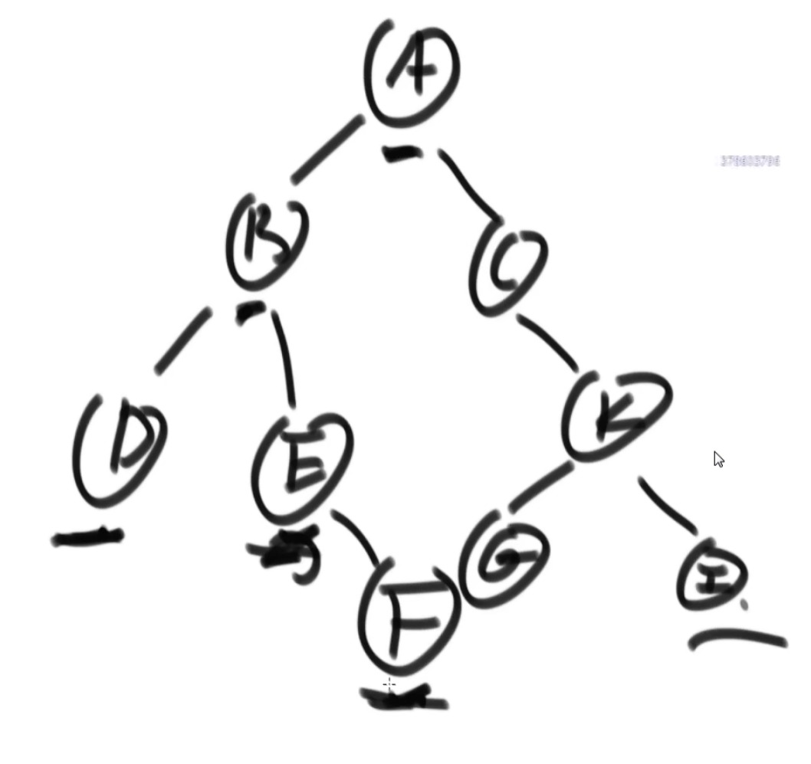

```java

```