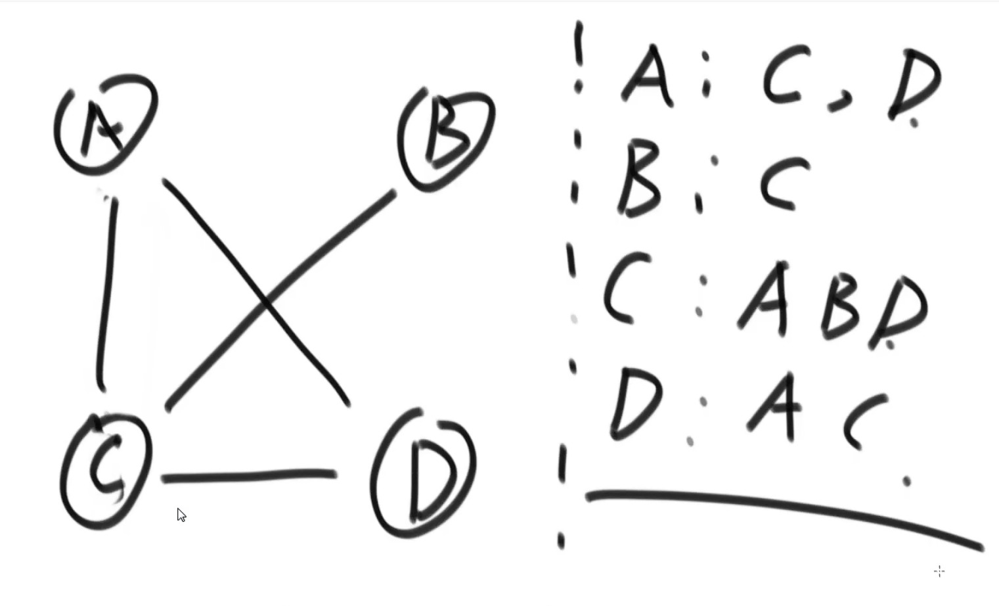
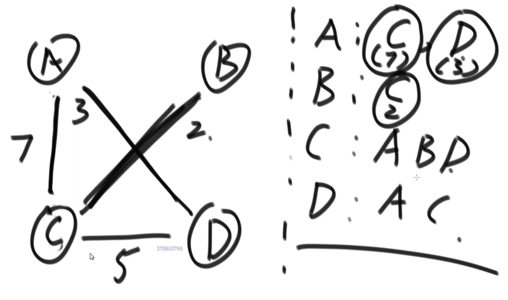
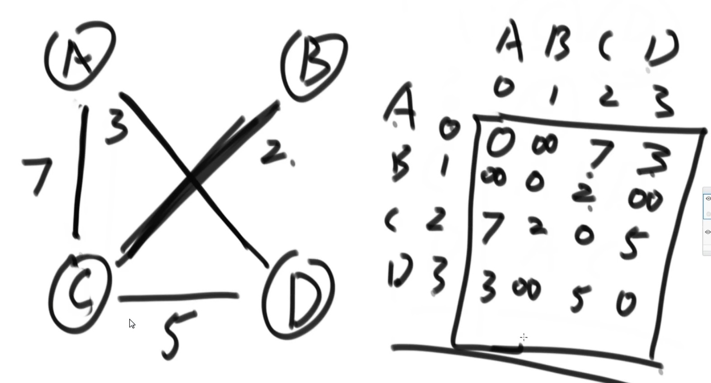
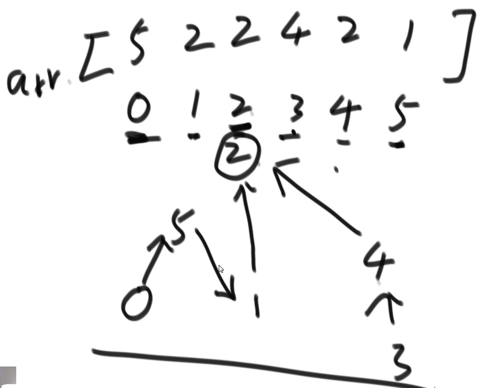
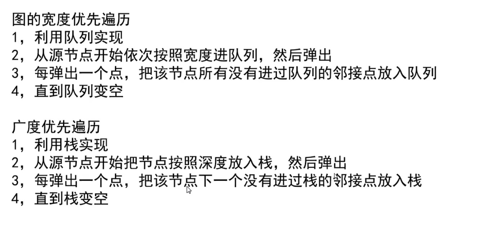
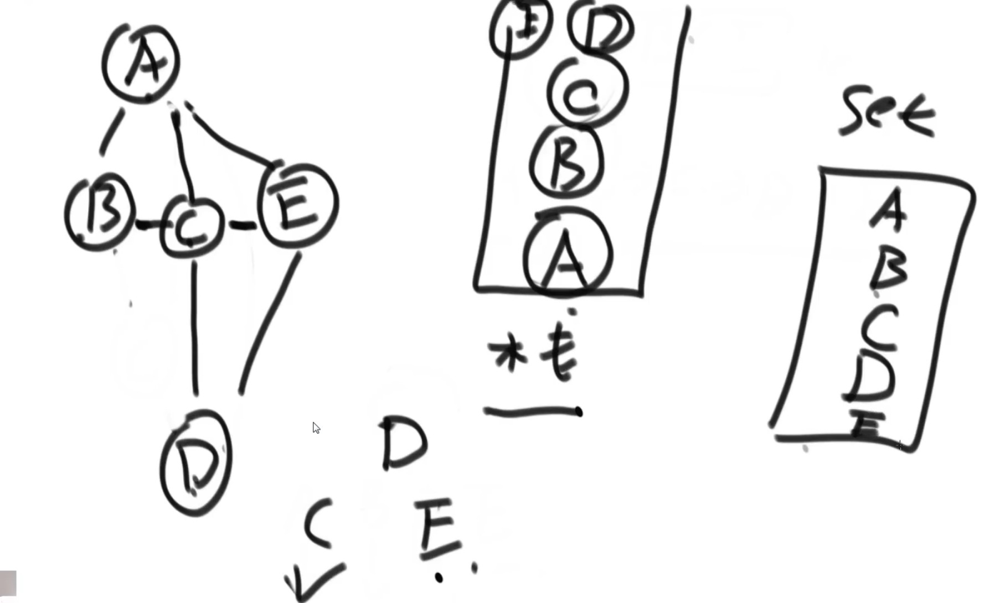
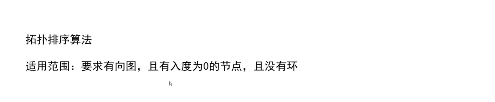
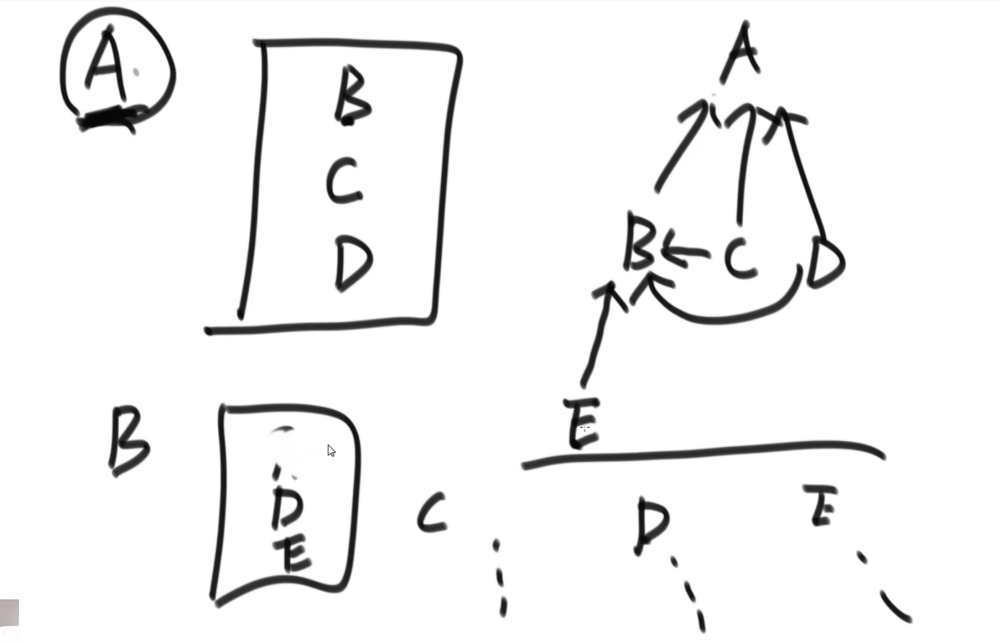

# 图

## 图的存储方式

1. 邻接表
2. 邻接矩阵

如何表达图？如何生成图  

1. 邻接表法



特殊


```java
// 图的结构模板
public class Node {
    public int value;  // 値
    public int in; // 入度
    public int out; // 出度
    public ArrayList<Node> nexts; // 从该点发散出去的点
    public ArrayList<Eage> edges; // 从该点发散出去的边

    public Node(int value) {
        this.value = value;
        in = 0;
        out = 0;
        nexts = new ArrayList<>();
        edges = new ArrayList<>();
    }
}

// 有向边
// 无向边(有向边*2)
public class Edge {
    public int weight; // 权值
    public Node form;  // 
    public Node to;

    public Edge(int weight, Node from, Node to) {
        this.weight = weight;
        this.from = from;
        this.to = to;
    }
}

public class Graph {
    public HashMap<Integer, Node> nodes;
    public HashSet<Edge> edges;

    public Graph() {
        nodes = new HashMap();
        edges = new HashSet();
    }
}

// N*3的矩阵
// [weight, from节点上边的值，to节点上面的值]
public static Graph createGraph(Integer[][] matrix) {
    Graph graph = new Graph();

    for (int i = 0; i < martix.length; i++) { // matrix[0][0] matrix[0][1] matrix[0][2]
        Integer from = matrix[i][0];
        Integer to = matrix[i][1];
        Integer weight = matrix[i][2];

        if (!graph.nodes.containsKey(from)) {
            graph.nodes.put(from, new Node(from));
        }
        if (!graph.nodes.containsKey(to)) {
            graph.nodes.put(to, new Node(to));
        }

        Node fromNode = graph.nodes.get(from);
        Node toNode = graph.nodes.get(to);

        Edge newEdge = new Edge(weight, fromNode, toNode);
        fromNode.nexts.add(toNode);
        fromNode.out++;
        toNode.in++;
        fromNode.edges.add(newEdge);

        graph.edges.add(newEdge);
    }

    return graph;
}
```

## 图的遍历



图遍历与二叉树遍历的区别，二叉树是没有环的，但是图的话可能会有环  

```java
// 图的宽度优先遍历
public static void bfs(Node node) {
    if (node == null) {
        return;
    }

    Queue<Node> queue = new LinkedList<>();
    HashSet<Node> set = new HashSet();
    queue.add(node);
    set.add(node);
    while (!queue.isEmpty()) {
        Node cur = queue.poll();
        System.out.println(cur.value);
        for (Node next : cur.nexts) {
            if (!set.contains(next)) {
                queue.add(next);
                set.add(next);
            }
        }
    }
}
```

```java
// 图的广度(深度)优先遍历
public static void dfs(Node node) {
    if (node == null) {
        return;
    }

    Stack<Node> stack = new Stack<>();
    HashSet<Node> set = new HashSet<>();
    
    stack.add(node);
    set.add(node);
    System.out.println(node.value);
    
    while (!stack.isEmpty()) {
        Node cur = stack.pop();
        for (Node next : cur.nexts) [
            if (!set.contains(next)) {
                stack.push(cur);
                stack.push(next;)

                set.add(next);
                System.out.println(next);
                
                break;
            }
        ]
    }
}
```



## 拓扑排序算法



例如根据config的包的依赖，来确定编译顺序

操作顺序

1. 先找到入度为0的点，输出该点
2. 然后擦掉该点的影响，
3. 擦掉后再寻找，入度为0的点，重复操作



```java
/**
 * 拓撲排序
 * 依次找入度為0的点，然后将該点的影响擦掉，如此循環往复
 */
public class TopologySort {
    // directed graph and no loop
    public static List<Node> sortedTopology(Graph graph) {
        // key: 某一个node
        // value: 剩余的入度
        HashMap<Node, Integer> inMap = new LinkedList<>();
        // 入度為0的点，才能進這個隊列
        Queue<Node> zeroInQueue = new LinkedList<>();
        
        // 記錄每一個Node的入度
        for (Node node : graph.nodes.values()) {
            inMap.put(node, node.in);
            if (node.in == 0) {
                zeroInQueue.add(node);
            }
        }
        
        // 拓扑排序的結果，依次加入result
        List<Node> result = new ArrayList<>();
        while (!zeroInQueue.isEmpty()) {
            Node cur = zeroInQueue.poll();
            result.add(cur);
            for (Node next : cur.nexts) {
                inMap.put(next, inMap.get(next) - 1);
                if (inMap.get(next) == 0) {
                    zeroInQueue.add(next);
                }
            }
        }

        return result;
    }
}
```

## kruskal算法（k算法）通過邊的角度來思考

適用範圍：要求無向圖  
最小生成樹  
用最少的邊來，保證每個點聯通，並且每條邊累加和最小  

實現步驟：通過邊的角度來思考

1. 將每條邊進行排序
2. 從最小的邊開始看，如果加上這條邊沒有形成環則加上，如果加上這條邊形成環則不要
3. 如此循環

難點是如何在考察一條邊的時候知道會不會形成環  
-> 集合查詢 或 並查集

```java
// 該方法並沒有並查集快
public static class MySets {
    public HashMap<Node, List<Node>> setMap;

    public MySets(List<Node> nodes) {
        for (Node cur : nodes) {
            List<Node> set = new ArrayList<Node>();
            set.add(cur);
            setMap.put(cur, set);
        }
    }

    public boolean isSameSet(Node from, Node to) {
        List<Node> fromSet = setMap.get(from);
        List<Node> toSet = setMap.get(to);
        // 比較內存地址
        return fromSet == toSet;
    }

    public void union(Node from, Node to) {
        List<Node> fromSet = setMap.get(from);
        List<Node> toSet = setMap.get(to);

        for (Node toNode : toSet) {
            fromSet.add(toNode);
            setMap.put(toNode, fromSet);
        }
    }
}

public static class EdgeComparator implements Comparator<Edge> {
    @Override
    public int compare(Edge o1, Edge o2) {
        return o1.weight - o2.weight;
    }
}

public static Set<Edge> kruskal(Graph graph) {
    // 可以用MySet代替
    UnionFind unionFind = new UnionFind();
    unionFind.makeSets(graph.nodes.values);

    // 堆 按照權值的從小到大依次彈出
    PriorityQueue<Edge> priorityQueue = new PriorityQueue<>(new EdgeComparator());
    for (Edge edge: graph.edges) { // M條邊
        priorityQueue.add(edge);
    }
    
    Set<Edge> result = new HashSet<>();
    while(!priorityQueue.isEmpty()) { // M條邊
        Edge edge = priorityQueue.poll();
        if (!unionFind.isSameSet(edge.from, edge.to)) {
            result.add(edge);
            unionFind.union(edge.from, edge.to)
        }
    }
}
```

## prim算法（P算法）通過點的角度來思考

适用範圍：要求无向圖

```java
public static class EdgeComparator implements Comparator<Edge> {
    @Override
    public int compare(Edge o1, Edge o2) {
        return o1.weight - o2.weight
    }
}

public static Set<Edge> primMST(Graph graph) {
    // 解鎖的邊進入小根堆
    PriorityQueue<Edge> priorityQueue = new PriorityQueue<>(new EdgeComparator);

    HashSet<Node> set = new HashSet<>();

    Set<Edge> result = new HashSet<>(); // 一次挑選的邊放到result裡面

    for (Node node : graph.nodes.values) { // 隨便挑了一個點（for循環的意義在於解決圖的連通性 如果事前可以確定圖是聯通的，那麼這個for循環可以不要）
        // node是開始點
        if (!set.contians(node)) {
            set.add(node);

            for (Edge edge : node.edges) { // 由一個點。解鎖所有相連的邊
                priorityQueue.add(edge);
            }

            while (!priorityisEmpty) {
                Edge edge = priorityQueue.poll(); // 彈出解鎖的邊中最小的邊
                Node toNode = edge.to; // 可能得一個新的點

                if (!set.contains(toNode)) {// 不含有的時候就是新的點
                    set.add(toNode);
                    result.add(edge);

                    for (Edge nextEdge: toNode.edges) {
                        priorityQueue.add(nextEdge)
                    }
                }
            }
        }

        return result;
    }
}
```

## Dijkstra算法

適用範圍：可以有權值為負數的邊（不能出现权值累加和为负数的环， 如果为负数的的话在环中每转一次计算出来的结果都会变小）

一定要規定出發點，求出發點到所有點的最短路徑

```java

```