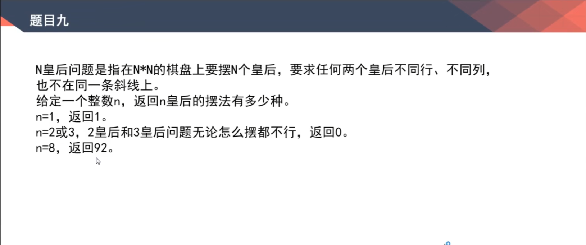

# 介绍前缀树

何为前缀树？如何生成前缀树？

例子：

一个字符串类型的数组arr1,另一个字符串类型的数组arr2。arr2中有哪些字符是arr1中出现的？
请打印。arr2中有哪些字符，是作为arr1中某个字符串前缀出现的？arr2中出现次数最大的前缀。

p: 经过的次数
e: 每个字符串结尾时的次数  

/Code01_TrieTree.java

# 贪心算法

在某一个标准下， 优先考虑最满足标准的样本， 最后考虑不满足标准的样本， 最终得到一个答案的算法，叫做贪心算法

也就是说，不从整体最优上加以考虑，所做出的是在某种意义上的局部最优解

局部最优 -?-> 整体最优

/Code04_BestArrays.java

/Code02_LowestLexicography.java

/Code03_LessMoneySplitGold.java

/Code05_IPO.java

这个题目和贪心没啥关系，是堆的应用
步骤：  
1. cur <= 大根堆顶部
2. 是 cur入大根堆 否 cur 入小根堆
3. 大根堆小根堆比较size，如果size差超过2，则将size较大的堆顶元素弹出放到元素较少的堆中去

