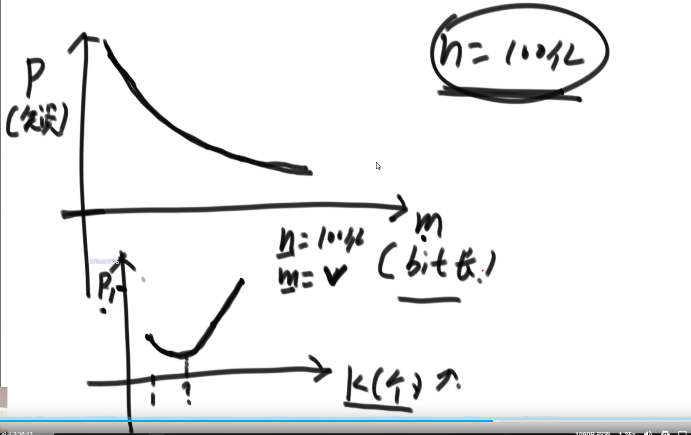

# 认识哈希函数和哈希表的实现

## 1.哈希函数的性质特征

### 1.1 $out = f(in)$

- 输入域 $in \to \infty$ 无限  
- 输出域 $out \to S$ 相对有限的
- MD5 的返回值范围 $0 \to 2^{64} - 1$  
    ```0xffff ffff ffff```  
- SHa1 的返回值范围 $0 \to 2^{128} -1$  
    ```0xffff ffff ffff ffff ffff ffff```  

### 1.2 same in -> same out

    有不随机的性质

### 1.3 diff in -> same out (哈希碰撞)

    哈希碰撞的概率非常低

### 1.4 离散型和均匀性

    通过哈希函数计算出的值可以均匀的映射到值域 S 上，并且具有离散型，稍微有一点不同的输入也会输出差异非常大的输出。

### 1.5 哈希函数的值域在模完(%m)之后的值也能保证均匀分布

    因为哈希函数的值域会很大，所以有时候需要模上一个M来减小值域的范围

$$
\{{in_1, in_2, in_3, ...}\} \frac{\:\:\:\:f\:\:\:\:}{}\ >\{{out_1, out_2, out_3, ...}\} \frac{\:\:\:\:{\%m}\:\:\:\:}{}\ > \{{m_1, m_2, m_3, ...}\}\\
m的值域 \:\:\:0\:->m-1
$$

### 例题1

一个含有无符号整数的文件，范围为$0 -> 2^{32} -1$(0到42亿多一点)，在文件中含有40亿个这样的数，在只给定1G内存的情况下，计算出出现最多次数的数是哪个，怎么做？

    如果用Hash表来做
    Hash key(int) value(count)
          ^         ^
          4B        4B
    最差情况为该文件的所有数都不一样则需要8B * 40亿 约为(32G) (但是自己算得个298个G)


    可以通过下面的方式来解决该问题
$$
\{{a_1, a_2, ... a_{40亿}}\}  
\frac{\:\:\:\:f(hash)\:\:\:\:}{}\ >  
\{{b_1, b_2, ... b_{40亿}}\}
\frac{\:\:\:\:{\% 100}\:\:\:\:}{}\ >
\{{m_1, m_2, ... m_{100}}\}
$$
    将40亿个数的大文件分割成，若干的小文件，由于哈希函数具有same in same out的性质，所以可以保证相同的数会被分配到同一个文件里去。
    关于不同的数也会由于hash函数的性质被均匀的分不到100个小文件当中去。
    然后再逐个统计分割后的小文，最后计算出出现最多的数是哪个，来达到减少内存空间使用的问题。

## 2.哈希表的实现

    [0, 1, 2, 3, 4, 5, 6, ... 13, ...  17]
        v                      v
      "abc"                  "bck"
                               v
                             "zky"

    通过单向链表的方式来处理插入的数据

    "abc",  34
      | f(hash) O(1)
      v
     out1 -> 取模 %17 O(1) -> 1 O(K) 在该单项链表不是特别长的情况下，时间复杂度为 O(1) 

    "bck",  32
      | f(hash)
      v
    out2  -> 取模 %17 -> 13

    "zky",  18
      | f(hash)
      v
    out3  -> 取模 %17 -> 13

    -> 问题如果插入数据过多，会导致每个桶上的元素过多，从而导致查询的时间复杂度不能达标 $O(1)$,所以在这个时候，一旦某个单项链表的长度超过给定的阈值，就去出发扩容逻辑

    [0, 1, 2, 3, 4, 5, 6, ... 13, ...  34]
    格子的长度扩充到原来的2倍，原数据的每个元素通过从新取模运算，然后挂到新的格子当中去。

    哈希表扩容代价的计算

    加N个字符串需要经过多少次扩容
$$
logN 次
$$
    假设有1000个str，哈希表的链长度不能超过2
    2 > 4 > 8 > 16 > ...  > 1000

$$
1000 = 2^x\\
x = log_2 {1000}
$$

    假设链长度不能超过K那么最差也只需要

$$
logN 次
$$

    每次扩容的代价为

$$
O(N)
$$

    加N个字符的整个扩容的代价为

$$
O(N * logN)
$$

    单词平均的扩容代价为

$$
\frac{O(N * logN)}{N} = O(logN)\\
通过增加链表K的长度可以使得O(logN)的值趋近于O(1)
$$

    JVM的离线扩容技术
    在哈希表在需要扩容的时候，哈希表的扩容处理不会占用用户的使用时间，而是先让用户继续使用旧的Hash表，当扩容处理结束后再把流量切到新的Hash表上，这样就可已在用户使用上做到O(1)的时间复杂度，但是理论上还是O(logN)级别的时间复杂度。

    不是虚拟机语言做不到 

    每个语言对于Hash表会有不同的优化，C++采用的是经典Hash表结构

    比如说经典的Hash表的每个格子存的是单项链表，也可将单项链表换成有序树(Java)

    还有开放地址法，每个格子(桶)里面存的是数组
    因为是数组结构所以在寻址的时候会比单项链表快
    [0, 1, 2, 3, 4, ...]
     ^
    [0, 1, ... 4] ---
                    |
                    v
                   [5, 6, ... 9]

### 例题2

设计RandomPool结构

【题目】  
设计一种结构，该结构中有如下三个功能
insert(key):将某个key加入到该结构，做到不重复加入
deletet(key):将原本在结构中的某个key移除
getRandom():等概率随机返回结构中的任何一个key
【要求】  
insert,delete,和getRandom方法的时间复杂度都是O(1)

    map1(str -> index)     int size = 26      map2(index -> str)

insert() 正常加  

    "A"  0                                    0   "A"
    "B"  1                                    1   "B"
    "C"  2                                    2   "C"
    "D"  3                                    3   "D"
    ...                                       ...
    "Z"  25                                   25  "Z"

delete("D")    
通过下面3步的更新和删除操作来保证index是连续的

    Step1:
    "A"  0                                    0   "A"
    "B"  1                                    1   "B"
    "C"  2                                    2   "C"
    "D"  3                                    3   "D" -> 3   "Z"
    ...                                       ...
    "Z"  25 -> "Z"  3                         25  "Z"

    Step2:
    "A"  0                                    0   "A"
    "B"  1                                    1   "B"
    "C"  2                                    2   "C"
    "D"  3 -> del                             3   "Z"
    ...                                       ...
    "Z"  3                                    25  "Z" -> del

    Step3:
    "A"  0                                    0   "A"
    "B"  1                                    1   "B"
    "C"  2                                    2   "C"
                                              3   "Z"
    ...                                       ...
    "Y"  24                                   24  "Y"
    "Z"  3                                    

    size--

getRandom()

    int randomIndex = (int) (Math.random() * size)
    gatRandom(randomIndex)
    ※Math.random()的值域 0 ~ 1

## 3.布隆过滤器

可以用来解决类似黑名单的问题，爬虫也是一样。
只有(add, check, del(x)),如果有删除情况的话就不能用布隆过滤器了，而是需要哈希表来实现。
并且允许有一定的失误率。

    url
    1) 黑 -> 白 布隆过滤器不会出现该类的误报，因为哈希函数有same in same out 的属性
    2) 白 -> 黑 (错杀)布隆过滤器会出现该类的误报，因为哈希函数具有diff in same out 的属性
    失误率不可避免

假设有一个100亿个url的黑名单文件(只有插入没有删除)，每个URL的长度为64Byte，当用户输入一个URL_x的时候，如何判断URL_x是否在黑名单文件中。

如果吧每条记录都存到内存里的话则需要6400亿Byte -> 640G(?) 5960G(?)
经典方法可以满足上诉需求但是内存消耗过高

### bit array / bit map

---

              size
    int[]     100   0 ... 99  每个元素4Byte 占用空间 400B  
    long[]    100   0 ... 99  每个元素8Byte 占用空间 800B
    bit[]     100   0 ... 99  每个元素1bit  占用空间 100/8 B

实现方法为用基础数据类型来拼

    int[] arr = new int[10]; // 32bit * 10 => 320bits

    // arr[0] int  0 ~ 31 可以表示 0 ~ 31位的bit数据
    // arr[1] int 32 ~ 63 可以表示32 ~ 63位的bit数据
    // arr[2] int 64 ~ 95 可以表示64 ~ 95位的bit数据

    int i = 178; // 想取得第178个bit状态 (从0起算)


    int numIndex = 178 / 32;
    int bitIndex = 178 % 32;

    // 拿到第178位的状态
    int s = ( (arr[numIndex] >> bitIndex) & 1 );

    [-2888]
    11111111111111111111010010111000                  
    >>                11111111111111111111010010111000
                                   ^                 ^
                                   18                0
    & 按位与
    [1] 
    00000000000000000000000000000001


    // 请把第178位的状态改成1
    arr[numIndex] = arr[numIndex] | (1 << (bitIndex))

                      11111111111111111111010010111000
                                   ^                 ^
                                   18                0
                                   | 按位或
    00000000000000000000000000000001                <<
                                   1 | 0 = 1
                                   1 | 1 = 1
    
    // 请把第178位的状态改成0
    arr[numIndex] = arr[numIndex] & (~ (1 << bitIndex));
                      11111111111111111111010010111000    
                                   ^                 ^
                                   18                0
                                   & 按位与
    00000000000000000000000000000001                <<
    11111111111111111111111111111110                 ~
                                   1 & 0 = 0
                                   0 & 0 = 0

    &   与      两个位都为1时，结果才为1
    |   或      两个位都为0时，结果才为0
    ^   异或    两个位相同为0，相异为1
    ~   取反    0变1，1变0
    <<  左移    各二进位全部左移若干位，高位丢弃，低位补0
    >>  右移    各二进位全部右移若干位，对无符号数，高位补0，有符号数，各编译器处理方法不一样，有的补符号位（算术右移），有的补0（逻辑右移）

布隆过滤器其实就是一个大的位图  

    bit arr
    {0 ...................................................... m-1}
    size = m /8 Byte

    add 黑名单
$$
url1 \frac{\:\:\:\:f_1(hash)\:\:\:\:}{}\ >  out1 \frac{\:\:\:\:{\%m}\:\:\:\:}{}\ > m1\\
url1 \frac{\:\:\:\:f_2(hash)\:\:\:\:}{}\ >  out2 \frac{\:\:\:\:{\%m}\:\:\:\:}{}\ > m1\\
url1 \frac{\:\:\:\:f_3(hash)\:\:\:\:}{}\ >  out3 \frac{\:\:\:\:{\%m}\:\:\:\:}{}\ > m1\\
.
.
.\\
url1 \frac{\:\:\:\:f_k(hash)\:\:\:\:}{}\ >  outk \frac{\:\:\:\:{\%m}\:\:\:\:}{}\ > m1\\
$$

    bit arr
    {0 ...................................................... m-1}
          ^      ^       ^^^     ^       ^^^       ^
          m1     m2      ...     k       ...       m3

    所有的黑名单url都经过上述操作都调用K个哈希函数都模上m然后再bit arr中都描黑。

    当用户有一个新的urlx过来时，也同样经过上诉操作，然后讲得出的结果与bit arr中的结果对照，
    如果所有的点已经都被描黑则说明用户请求的urlx在黑名单中。
    如果有一个点没有被描黑则说明该url不在黑名单中。
    这样做根据hash函数的diff in same out性质虽然会有错杀的概率，但是该概率非常低。
    如果m定的太短， 或者k的数量不合理，则会导致错杀几率变高
    k的作用其实就是采集特征(采集指纹 )。

问题: k的hash函数有几个，m的长度是多大。



    n是给定数值，m越大p越低。
    当确定好m后，k与p的关系则为抛物线，在图像最低点出失误率最低。

布隆过滤器公式:

只跟下面两个参数有关
n = 样本量  
p = 失误率
※和单个样本大小无关，反正都要走哈希函数

$$
m_{理论} = - \frac{n * lnP}{(ln2)^2}\\
\:
\\
k_{理论} =  ln2 * \frac{m_{理论}}{n}\approx 0.7 * \frac{m_{理论}}{n} \:\:\: 向上取整\\
如果在这一步可以调整m，使得m更大的话会进一步降低失误率\\
\:
\\
P_真 = (1 - e^{-\frac{n * k_真}{m_真}})^{k_真}
$$

## 4.详解一致性哈希原理

是用来讨论数据服务器怎么组织的一个问题。

    logic [ logic1, logic2, logic3 ... ]
               |_______|_______|
               |
    DB    [ DataBase ]
             MySQL PostgreSQL
             不支持分布式
             是拿一台特别吊的机器在抗

    经典的分布式数据库组成
    logic [ logic1, logic2, logic3 ... ]
               |       |       |
               f(hash) f(hash) f(hash) 
               |       |       |
               out%3   out%3   out%3

    通过取模的方式来确定数据该哪个数据库
    已经可以很好的保证数据的均匀分布
    DB    [ DB1, DB2, DB3]

    在负载均衡时一定要选择种类比较多并且在高中低频都有一一定数量的key，这样才能保证每个数据库负载均衡。

    经典模式的问题在于，在增加或减少数据库时，数据迁移的代价是全量的。
    因为正加或减少一台机器的时候，数据库里所有的数据都需要重新算一遍hash值然后再去重新模。

一致性哈希不模任何东西。

    假设用MD5算法做哈希函数
$$
MD5 = 0 \sim 2^{64} - 1
$$

    把他的值域想象成一个环
    [ 0, 1, 2, 3, 4, 5,...,2^32, 2^10, ...2^64 - 1]
         ^        ^        ^              ^        
         out2     out_zuo  out3           out1     
    机器
    m1 > 用可以区分出机器的信息(hostname)做哈希函数 > out1
    m2 > 用可以区分出机器的信息(hostname)做哈希函数 > out2
    m3 > 用可以区分出机器的信息(hostname)做哈希函数 > out3

    当一个请求进来时
    例如{"zuo", 33} > 做同样的哈希函数 > out_zuo
    计算出来的out_zuo一定也会打到上面的环上。
    该条数据这属于在环上顺时针离自己最近的地方。
    上图的话，这条数据应该属于m3。

    如何实现:

    逻辑端
    [ logic1, logic2, logic3, ... ]
        |________|_______|
        |    
    __________________
    [out1, out2, out3]

    将通过哈希函数计算出来的有序数组，分别存储在各个逻辑端。
    通过在这条有序数组来上做二分查找，就能确定 >={out_zuo} 最左的数据是哪个。

    在这种情况下，如果需要加一台机器m4
    [ 0, 1, 2, 3, 4, 5,...,2^32, 2^10, ...2^64 - 1]
         ^        ^        ^              ^        
         out2     out4     out3           out1     
         m2       {m4}     m3             m1
    这时候只需要将m3的m2 ~ m4的数据，加到m4里就可以完成机器的增加操作。
    反过来删除m4的时候，m4内的数据重新计算hash值然后还给m3即可。
    数据迁移的代价会减少很多。

    存在的问题；
    1.在机器数量很少时，无法做到计算出得hash值能正好将环均分，从而导致数据分配的不平衡。
    2.就算计算出得hash值能刚好将环均分，但是在增加或减少一个机器时，会马上导致负载不均衡。

    虚拟节点技术
    为每台机器分配1000个字符串，利用字符串计算出得hash值取抢环，因为hash函数具有离散性，所以在数量足够多得情况下可以保证每个点在环上均匀分布。
    m1 [a1, a2, a3, ........ a1000]
    m2 [b1, b2, b3, ........ b1000]
    m3 [c1, c2, c3, ........ c1000]
    
    由于离散性可以保证在环上的任何一段，都可以保证m1,m2,m3都是1:1:1分布的所以在增加或减少一台机器的时候，也可以保证从m1,m2,m3上均匀的按比例夺数据/还数据。
    m4 [d1, d2, d3, ........ d1000]

    虚拟节点的妙用
    可以通过增加和减少虚拟节点来调整各个机器的负载。
    例如
    m1 [a1, a2, a3, .... a1000, a1001, ... a2000]
