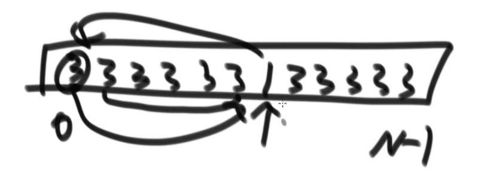
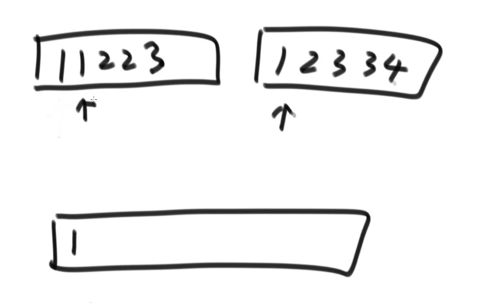
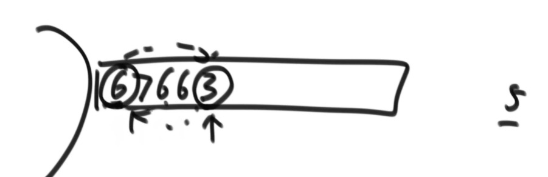
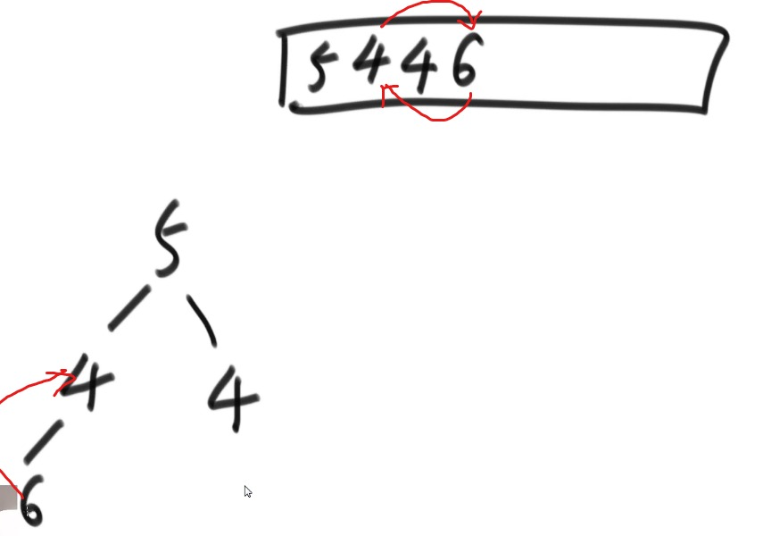
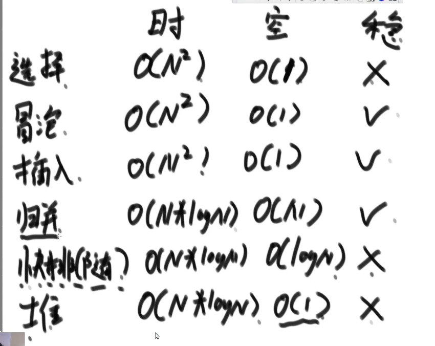

# 详解桶排序以及排序内容大总结

## 堆

1. 堆结构就是用数组实现的完全二叉树结构
2. 完全二叉树中如果每颗子树的最大值都在顶部就是大根堆
3. 完全二叉树中如果每颗子树的最小值都在顶部就是小根堆
4. 堆结构的heap Insert与heapify操作
5. 堆结构的增大和减少
6. 优先级队列结构，就是堆结构

### 1. 完全二叉树

```java
从左往右依次边满的数为完全二叉树

1. 只有一个点， 满二叉树 也是 完全二叉树
            o
2. 如果是从左往右依次变满也是完二叉树
            o
           / 
          o
3. 满二叉树
            o
           / \ 
          o   o
4. 完全二叉树
            o
           / \ 
          o   o
         /
        o
5. 满二叉树
            o
           / \ 
          o   o
         / \
        o   o
6. 既不是完全二叉树，也不是满二叉树
            o
           / \ 
          o   o
         / \   \
        o   o   o

完全二叉树的实现
可以把数组从0出发的梁宇一段可以对应成完全二叉树

[3, 5, 2, 7, 1, 9 ,6]  size = 7
 0  1  2  3  4  5  6

                3              0
             -------
            /       \
           5         2         1 2
          / \       / \
         7   1     9   6       3 4 5 6

位置关系的描述(下标变换)
i左 = 2 * i + 1     i位置的左孩子
i右 = 2 * 1 + 2     i位置的右孩子
i父 = (i - 1) / 2   i位置的父节点
```

### 2. 大根堆,小根堆

```java
                6             以6位头的整棵树最大值为6
             -------
            /       \
           5         4        以5位头的整棵树最大值为5   以4位头的整棵树最大值为4
          / \       / \
         4   3     3   0      以4位头的整棵树最大值为4   以3位头的整棵树最大值为3  ...
```

## 3. 堆结构的heap Insert与heapify

### heap insert

```java
构成大根堆
[5, 3, 6, 7, 7, ...] heapsize

每次插入的时候都要保证父节点为最大值

1. 
                5             
             -------
[5] heapsize = 1

2.      
                5              
             -------
            /       
           3    
[5, 3] heapsize = 2     

3.
                5              
             -------
            /       \
           3         6
[5, 3，6] heapsize = 3

4.
                6              
             -------
            /       \
           3         5
[6, 3，5] heapsize = 3

5.
                6              
             -------
            /       \
           3         5
          /
         7
[6, 3，5, 7] heapsize = 4

6.
                6              
             -------
            /       \
           7         5
          /
         3
[6, 7，5, 3] heapsize = 4

7.
                7              
             -------
            /       \
           6         5
          /
         3
[7, 6，5, 3] heapsize = 4
为了确保每一层的父节点都是当前整棵树的最大值，需要逐层递归确保父节点最大

8.
                7              
             -------
            /       \
           6         5
          / \
         3   7
[7, 6，5, 3，7] heapsize = 5

9.
                7              
             -------
            /       \
           7         5
          / \
         3   6
[7, 7，5, 3，6] heapsize = 5

// 某个数现在处在index位置， 往上继续移动
public static void heapInsert(int[] arr, int index) {
    while (arr[index] > arr[(index - 1) / 2]) { // 当子节点比父节点大时  index来到0位置时 (index - 1) / 2 = 0 
        swap(arr, index, (index - 1) / 2); // 子节点与父节点交换
        index = (index - 1) / 2; // index 上移到父节点
    }
}

```

### heapify(堆化)

```java
取大根堆中的最大值，然后删除该节点，要求删除后依然保持大根堆的结构

[6, 3, 5, 2, 3, 4] heapsize = 6

1.
                6              
             -------
            /       \
           3         5
          / \       /
         2   3     4

2.
                4              [6]存到一个变量里
             -------           将数组的最后一个元素放到0位置
            /       \          将heapsize - 1 = 5相当于把数组的最有一个元素无效化
           3         5
          / \       /
         2   3     4
                4              
             -------           
            /       \          
           3         5
          / \       
         2   3     
3.
                4              4与自己的子节点的最大值比较，如果子节点的最大值比自己大，则与子节点位置交换
             -------           以此类推知道结束
            /       \          
           3         5
          / \       
         2   3  
                5              
             -------           
            /       \          
           3         4
          / \       
         2   3    
        
// 某个数在index位置，能否向下移动(堆化)
public static void heapify(int[] arr, int index, int heapSize) {
    int left = index * 2 + 1; // 左孩子的下标

    while (left < heapSize) { // 下方还有孩子的时候
        // 两个孩子中，谁的值大，把下标个largest
        int largest = left + 1 < heapSize &&  arr[left] < arr[left + 1] ? left + 1 : left;

        // 父和孩子之间，谁的值大，把下标给largest
        largest = arr[largest] > arr[index] ? largest : index;

        // 结束条件
        if (largest == index) {
            break;
        }

        // 交换父节点与子节点的值
        swap(arr, largest, index);

        // 下标下移
        index = largest;
        left = index * 2 + 1;
    }
}

```

## 4.堆结构的增大与减小

```java
例题
如果需要把堆中的任意一个元素的值变换之后，仍然要保持对结构的话
只需要判断一下变换后的值 是比原来的大 还是比原来的小
如果变大的话 向上做heap insert
如果边小的话 向下做heapify

完全二叉树的高度为logN级别
在堆中增加一个元素的调整代价为O(logN)级别
在堆中删除一个元素的调整代价为也O(logN)级别

最多调整的次数为整棵树的高度
```

### 堆排序

```java
1. 先将数组构成以个大根堆
2. 将大根堆的第一个位置的数与最后一个位置的数做交换, 然后heapsize-- -> 相当于最大值已经找到并且和堆断掉联系
3. 从交换后的堆的第一个为值开始做heapify
4. 重复 2，3 直到结束 (heapsize == 0)

// 整体复杂度O(NlogN) 额外空间复杂度O(1)
public static void heapSort(int[] arr) {
   if (arr == null || arr.length < 2) {
      return;
   }

   // 将数组构成大根堆 复杂度O(NlogN)
   for (int i = 0; i < arr.length; i++) { // O(N)
      heapInsert(arr, i); // O(logN)
   }

   // 更快的方法 从叶子节点向下做heapify 而不是从头做heap insert
   // for (int i = arr.length -1; i >= 0; i--) {
   //    heapify(arr, i, arr.length);
   // }

   // 设定堆的heapSize
   int heapSize = arr.length;

   // 将大根堆的第一个位置的数与最后一个位置的数做交换, 然后heapsize-- -> 相当于最大值已经找到并且和堆断掉联系
   swap(arr, 0, --heapSize); // O(1)
   while (heapSize > 0) { // O(N)
      // 交换后的堆的第一个为值开始做heapify
      heapify(arr, 0, heapSize); //  O(logN)

      // 将大根堆的第一个位置的数与最后一个位置的数做交换, 然后heapsize-- -> 相当于最大值已经找到并且和堆断掉联系
      swap(arr, 0, --heapSize); // O(1)
   }
}


扩展
如果用户一股脑把所有的数都给了，而不是一个一个给的情况下，构成大根堆的更好的方法
1. 因为所有的数都已经给定，所以可以想象成完全二叉树已经有了，只是不是大根堆的结构
2. 从堆的最下层开始做heapify

每层元素的调整次数

倒数1层 N/2个元素 调1次
倒数2层 N/4个元素   2
倒数3层 N/8个元素   3
.
.
.

整体复杂度

           T(N) = N/2 * 1 + N/4 * 2 + N/8 * 3 + N/16 * 4 ...

2T(N) = N/2 * 2 + N/2 * 2 + N/4 * 3 + N/8 * 4 ...

两个式子错项相减

T(N) = N + N/2 + N/4 + N/8 + ...

等比数列 O(N)
```

### 堆排序扩展题目

已知一个几乎有序的数组，几乎有序是指，如果把数组排好序的话，每个元素移动的距离可以不超过K，并且k相对于数组来说比较小。
请选择一个合适的排序算法针对这个数组进行排序。

```java
假设k = 6
准备一个小根堆

[                      ]
 012345678

先将数组的前7个数放入小根堆，然后将顶点弹出放到数组的0位置，然后将第8个数放入小根堆，再弹出顶点放到数组的第二个位置，
周而复始，当最后一个元素添加到小根堆后，将小根堆顶点一次弹出结束。

复杂度O(NlogK)

每种语言有默认的堆结构，需要用的时候查一下

堆的扩容:成倍扩容(logN)次 单次扩容代价(N)水平
扩容代价O(NlogN)/N = O(logN)

系统提供的堆结构一般只支持 add 和 poll两个方法，分别对应元素的加入和顶点的弹出。
如果需要改其中某一个元素的值还要保持堆结构个话是不支持的。
如果硬要改的话，它会扫过所有的节点重新构建堆结构，调整的代价会比较高，做不到高效。
如果有这样的需求的话，必须要手写堆来实现。

public static void sortedArrDistanceLessK(int[] arr, int k) {
   // 默认小根堆
   PriorityQueue<Integer> heap = new PriorityQueue<> ();
   int index = 0;
   for (; index <= Math.min(arr.length, k); index ++) {
      heap.add(arr[index]);
   }
   
   int i = 0;
   for (; index < arr.length; i++, index++) {
      heap.add(arr[index]);
      arr[i] = heap.poll()
   }

   while(!heap.isEmpty()) {
      a[i++] = heap.poll();
   }
}
```

## 比较器的使用

1. 比较器的实质就是重载比较运算符
2. 比较器可以很好的应用在特殊标准的排序上
3. 比较器可以很好的应用在根据特殊标准排序的结构上

```java
数组

// 升序策略
public static class IdAscendingComparator implements Comparator<Student> {
   // 返回负数的时候，第一个参数排前面
   // 返回正数的时候，第二个参数排前面
   // 返回0的时候，谁在前面无所谓
   @Overrid
   public int compare(Student o1, Student o2) {
      return o1.id - o2.id; // 降序的话反过来即可
   }
}

Student[] students = new Student[] {student1, student2, student3};

// 第二的参数为比较策略
Arrays.sort(students, new IdAscendingComparator());

```

```java
堆

PriorityQueue 默认是小根堆如果需要改成大根堆的话则需要重写比较策略

public static class AComp implements Comparator<Integer> {
   @Overrid
   public int compare(Integer arg0, Integer arge1) {
      return arg1 - arg0;
   }
}

public static void main(String[] arges) {
   // 大根堆
   PriorityQueue<Integer> heap = new PriorityQueue<> (new Acomp());
}
```

## 桶排序思想下的排序

1. 计数排序
2. 基数排序

### 分析

1. 桶排序思想下的排序都不是基于比较的排序
2. 时间复杂度为O(N),额外空间复杂度为O(M)
3. 应用范围有限，需要样本的数据状况满足桶的划分

```java
计数排序
int [                                  ]  range 0~200 age

申请一个长度为201的数组
遍历数组统计词频
[0  1  2  ...  17  ... ]
 ++ ++ ++      ++

统计完后按顺序返回给原数组即可

不急于比较的排序的缺点是范围受限，比如数组特变大的时候
```

```java
基数排序

[17 13 25 100 72]
>> 补0
[017 013 025 100 072]

准备桶

---   ---   ---   ---   ---   ---   ---   ---


---   ---   ---   ---   ---   ---   ---   ---
 0     1     2     3     4     5     6     7

根据个位数据放桶
---   ---   ---   ---   ---   ---   ---   ---
100         072   013         025         017
                                             
                                             
                                             
---   ---   ---   ---   ---   ---   ---   ---
 0     1     2     3     4     5     6     7

从左往右依次将桶里的数倒出来
[100 072 013 025 017]

根据十位数据放桶
---   ---   ---   ---   ---   ---   ---   ---
100   013   025                           072
      017                                    
                                             
                                             
---   ---   ---   ---   ---   ---   ---   ---
 0     1     2     3     4     5     6     7

从左往右依次将桶里的数倒出来(先进先出)
[100 013 017 025 072]

根据百位数据放桶
---   ---   ---   ---   ---   ---   ---   ---
013   100                                    
017                                          
025                                          
072                                          
---   ---   ---   ---   ---   ---   ---   ---
 0     1     2     3     4     5     6     7

从左往右依次将桶里的数倒出来(先进先出)
[013 017 025 072 100]

相当于先排个位数，在排十位数，最后排百位数

但是这种排序依然使用范围有限，该排序一定需要有进制这个东西

public class RadixSort {

   public static void radixSort(int[] arr) {
      if (arr == null || arr.length < 2) {
         return;
         radixSort(arr, 0, arr.length - 1, maxbits(arr));
      }
   }

   // 计算这批数中最大的值有几个十进制位
   public static int maxbits(int[] arr) {
      int max = Integer.MIN_VALUE;
      for (int i = 0; i < arr.length; i++) {
         max = Math.max(max, arr[i]);
      }
      int res = 0;
      while(max != 0) {
         res++;
         max /= 10;
      }
      return res;
   }

   // arr[begin...end]排序 digit这批数中最大的值有几个十进制位
   public static void radixSort(int[] arr, int L, int R, int digit) {
      final int radix = 10; // 以十位基底
      int i = 0; j = 0;
      // 有多少个数准备多少个辅助空间
      int[] bucket = new int[R - L + 1];
      for (int d = 1; d <= digit; d++) { // digit有多少位就进出桶多少次
         // 10个空间
         // count[0] 当前位(d位)是0的数字有多少个
         // count[1] 当前位(d位)是(0和1)的数字有多少个
         // count[2] 当前位(d位)是(0，1，2)的数字有多少个
         // count[i] 当前位(d位)是(0 ~ i)的数字有多少个
         int[] count = new int[radix]; // count[0...9]
         for (i = L; i <= R; i++) {
            j = getDigit(arr[i], d); // 取出个位,十位，百位...的数
            count[j]++;              // 统计词频count
         }
         // 把count处理成前缀和
         for (i = 1; i < radix; i++) {
            count[i] = count[i] + count[i - 1];
         }
         // 从右向左遍历数组
         for (i = R; i >= L; i--) {
            j = getDigit(arr[i], d); // 取出个位,十位，百位...的数
            bucket[count[j] - 1] = arr[i]; // 通过词频数计算出下标
            count[j]--; // 词频--
         }
         for (i = L, j = 0; i <= R; i++, j++) {
            arr[i] = bucket[j]; // 将补助数组的数据倒回到原数组 完成当前位的操作
         }
      }
   }

   public static int getDigit(int x, int d) {
      return  ((x/ ((int) Math.pow(10, d - 1))) % 10)
   }
}

[013, 021, 011, 052, 062]

先统计词频 个位
count [0 2 2 1 0 0 0 0 0 0] length = 10
       0 1 2 3 4 5 6 7 8 9
加工统计后的词频 相邻两位累加向后推 （前缀和数组） 原来是个位数为2的数有多少个， 现在变成小于等于2的数有多少个
count [0 2 4 5 5 5 5 5 5 5] length = 10
       0 1 2 3 4 5 6 7 8 9

从有往左遍历数组
062 词频-1 计算下标 = 4-1 = 3  然后词频--
count [0 2(3)5 5 5 5 5 5 5] length = 10
       0 1 2 3 4 5 6 7 8 9

help辅助数组
[   ,    ,    , 062,   ]
  0    1    2    3   4

052 词频-1 计算下标 = 3-1 = 2  然后词频--
count [0 2(2)5 5 5 5 5 5 5] length = 10
       0 1 2 3 4 5 6 7 8 9

help辅助数组
[   ,    , 052, 062,   ]
  0    1    2    3   4

其他数也做同样的操作
因为从右向左遍历原数组，并且通过词频计算出得下标在当前个位范围里的最右侧，则模拟的桶的先进先出
```

## 排序算法的稳定性及其总汇

### 稳定性

```java
在排好序之后相同的元素能否维持元素的相对次序被保留下来
比如 1 在排好序之后仍然能保持 1 2 的顺序

[2, 1, 2, 1, 3, 2, 3]
    1     2

[1, 1, 2, 2, 2, 3, 3]
 1  2

如果是基础数据类型稳定性无所谓，
但是非基础数据类型则不一样，很有用

例如

[{class age} {class age} {class age} {class age} {class age}]

1.age sort [               小 -> 大                     ]

2.class sort [ {...1...} {...2...} {...3...} ]

如果排序稳定的话，在第二次 class sort 之后, 第一次按照 age sort 的排序结果是会得到保留的，
每个班级内部的学生年龄，也是按照 小 -> 大 排列
```

1. 选择排序做不到稳定性

2. 冒泡排序可以做到稳定性，因为当元素相等时元素位置不发生交换。
3. 插入排序可以做到稳定性，因为在元素插入时如果遇到相等的元素，插入位置在最后面，相对位置没有发生变化。
4. 归并排序可以做到稳定性，因为在merge的时候如果遇到相等的元素则先拷贝左边的元素然后再拷贝右边的，相对顺序没有发生变化。
   但是在利用归并排序求小和的时候，因为遇到元素相等的情况是先拷贝右边的元素，所以在此过程中丧失了排序的稳定性。

5. 快排做不到稳定性, 因为在进行首位元素位置交换的时候，稳定性已经被破坏。在做partition的时候就已经破坏了稳定性。

6. 堆排序做不到稳定性，在做heap insert的时候稳定性已经被破坏。

7. 计数排序和基数排序都是可以做到稳定性的，因为是方桶的方法，有先进先出的原则。在思路上就不是基于比较的排序。

### 总结

快排最快，堆排空间复杂度低，归并有稳定性
   

### 问题

1. 基于比较的排序，能否做到O(N*logN)以下的时间复杂度。 -> 目前没有
2. 基于比较的排序，能否做到时间复杂度在O(N*logN)，空间复杂度在O(N)以下时，还能做到稳定。 -> 目前没有

### 常见的坑

1. 归并排序的额外空间复杂度可以变成O(1)，但是非常难，不需要掌握，有兴趣可以搜 归并排序内部缓存法。
   但是这样做的代价是，使得归并排序失去了稳定性。如果这样的话还不如用堆排序取实现。
2. "原地归并排序" 之类的额外空间复杂度可以变成O(1)，之类的帖子都是垃圾，会让归并排序的时间复杂度变成O(N^2)
3. 快速排序可以做到稳定性，但是非常难，不需要掌握，可以搜"01 stable sort",
   但是该方法会让额外空间复杂度从O(logN)变成O(N)。
4. 所有以上的改进都不重要，因为目前还没有找到时间复杂度为O(N*logN), 额外空间复杂度为O(1), 又稳定的排序。
5. 面试题
   有一道题目，是奇数放在数组左边，偶数放在数组右边，还要求原始的相对次序不变，碰到这个问题可以怼面试官。
   可以通过"01 stable sort"来做，但是很难非常难。

   经典快排的partition做不到稳定性，但是经典快排的partition又是 0 1 标准，和奇偶问题其实是一种调整策略，
   快排做不到不知道怎么解。

## 工程上堆排序的改进

1. 充分利用O(N*logN)和O(N^2)排序的各自优势 -> 综合排序，快排+插入
2. 稳定性的考虑

Arrays.sort 内部实现， 基础类型用快排， 为基础类型用归并 -> 为了稳定性
